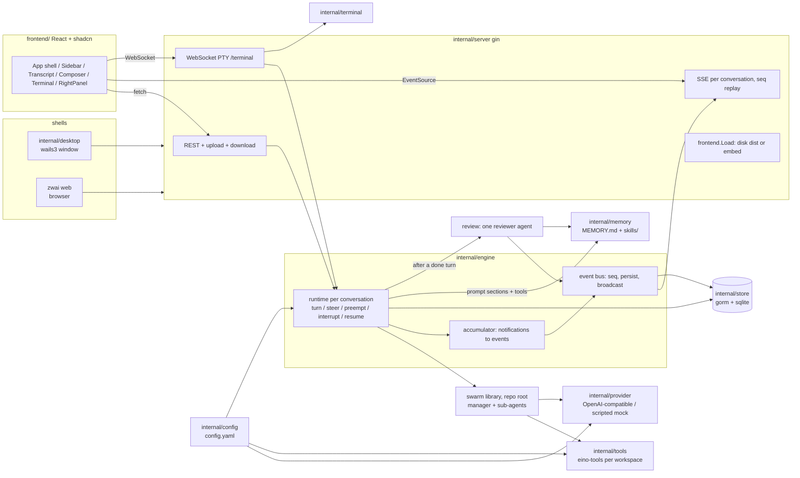
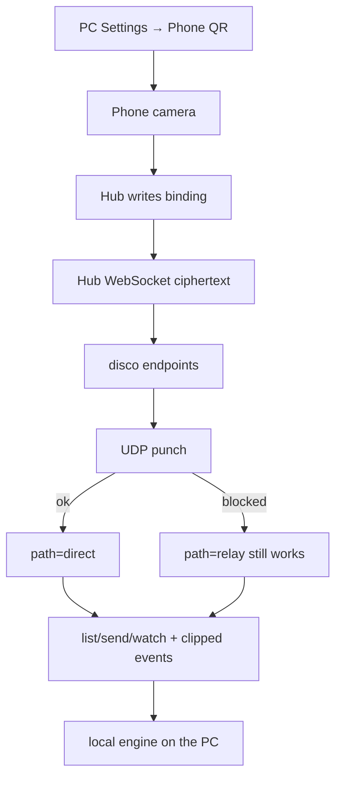

# Architecture

zwai is one Go process. It assembles a config, a SQLite database, a model pool, a
per-conversation agent runtime and an HTTP server, then puts either a native
window or a browser in front of it. Both shells load the **same** `http://127.0.0.1`
origin, so there is exactly one implementation of uploads, downloads and the live
event stream.



## Phone remote (pairlink)

The PC stays the system of record. A phone never hits gin `/api`. Binding is a
QR; data starts on the hub (DERP) and may upgrade to UDP. The hub sees
fingerprints and ciphertext length, not projects or events. The desktop host
must keep a live WebSocket on the hub (keepalive data frames, reconnect on
drop). The phone does the same on its ticket socket (a quiet hub drops after
60s). A drop paints a reconnect banner and retries the saved ticket — it
does not unlink. Pairing HTTP can succeed with a dead socket; redeem then
returns `host offline`. `GET /api/remote/status` `online` follows that socket. While pairing is on
and `remote.keep_awake` is on (the default), `internal/wakeup` holds a
system sleep assertion (`awake` on that same status). The assertion
follows the config, not the socket: a hub reload must not release and
re-acquire or idle sleep wins the gap. On macOS the hold is AC-only.



Path switches do not mint new session keys. `zwai trace` still keys off a turn
id; remote replies include pairlink `session_id` and `path`.

## Modules

| package | responsibility |
|---|---|
| `.` (root) | the swarm library: `Registry`, `spawn_agent`/`send_message`/`wait_agents`/`close_agent`/`resume_agent` (a missing argument or unknown target is `{"error"}` / `delivered:false`, not a Go error — eino's ToolNode would turn that into `NodeRunError` and kill the caller), `Restore`/`PlantFinished` for leftover workers, `RunWith` → `RunResult{Final, Transcript}`, `Notification` stream. Usable on its own — see [docs/LIBRARY.md](docs/LIBRARY.md). |
| `internal/config` | `config.yaml` under the data directory: load, normalize, atomic save, `OPENAI_*` seeding on first run. Nothing else in the tree hardcodes an endpoint or model. |
| `internal/store` | gorm + pure-Go SQLite. Conversations, transcript messages, turns, the event timeline, model-call records, attachments, follow-ups waiting for the current turn, `schedules` / `schedule_runs`, conversation search (`search_docs` + FTS5 `thread_fts`, optional `search_chunks`), and `remote_devices` (phone model + last-seen keyed by pairlink fingerprint). Sidebar lists conversations and projects by `sort_rank` then last activity (`last_active_at` / `updated_at`); unranked rows interleave by activity so they cannot sit above ranked work that just ran. A drop pins ranks. Quiet standalone fires are archived out of Recents. See [docs/DATA_MODEL.md](docs/DATA_MODEL.md). |
| `internal/provider` | builds eino chat models from config, lists an endpoint's catalog (`GET {base_url}/models`), records per-call telemetry, POSTs OpenAI-compatible `/embeddings` when search is on, and provides the scripted offline provider used by `--mock` and the tests (character n-grams stand in for a real embed). The provider request timeout is idle time between bytes, not the whole streamed body: a thinking model that is still emitting tokens is not cut off. |
| `internal/tools` | assembles the eino-tools toolset anchored at one conversation's workspace; catalog + enable/disable rules feed the Settings UI. `BindExecOutput` is the host binder that tees `exec` stdout/stderr into `NotifyToolDelta` without the swarm library importing eino-tools. A wrapper shortens a remaining-time `sleep` / `Start-Sleep` of five seconds or more to about a third of that duration so a progress poll still runs instead of sitting out the full estimate. |
| `internal/memory` | a project's memory as files: `MEMORY.md` notes under a character budget, `skills/<name>/SKILL.md` procedures, the three agent tools (`memory`, `skill_view`, `skill_manage` including `merge`), the prompt sections they are rendered into, the reviewer's instruction, and the deterministic family fold that keeps one subject as one skill. Owns the files; knows nothing about conversations. |
| `internal/engine` | one runtime per conversation: starts turns, queues follow-ups, steers running ones, preempts the current manager tool so unread steering lands on this turn, retracts one unread steer, interrupts, resumes leftover turns (and their in-flight sub-agents) after a crash or quit, keeps a rolling session briefing from the event log, folds earlier replay on `/compact` or automatically when a manager Generate would exceed `swarm.auto_compact_tokens` (microcompact of replayable tool results first, then the session briefing, optional pinned summarizer last; summarizer input is newest-first under a rune cap), pursues a standing `/goal` across turns until `complete_goal`, `block_goal`, a failed turn that is not a recoverable model error, a no-progress continuation (`goal_idle`), a pending thread wake (waiting is the next turn), a clear/interrupt, or `swarm.goal_max_auto_turns` (truncated tool JSON / `429` / a dropped stream retry in-turn then auto-continue), converts `swarm.Notification`s into persisted events, manages workspaces, projects and titles (placeholder, then a generated name), runs the post-turn memory review from the event log (note extraction skipped when the manager already wrote; leftover skill families still fold), and resolves an in-app terminal's working directory from the conversation or project the client named. A clock + ticker (`StartScheduler`) fires due waits (`schedule_fired`) or skips a busy target (`schedule_skipped`) without bursting missed ticks; event kinds `schedule` / `schedule_fired` / `schedule_skipped` / `schedule_report` / `schedule_cancelled` are the wire contract. |
| `internal/search` | ⌘K ranking. FTS5 is always on. Embeddings are off until Settings pins a model; then query vectors fuse with keywords via reciprocal rank fusion (`k=60`). Indexing embeddings is a background queue so a turn is not blocked on `/embeddings`. A failed query embed falls back to keywords. |
| `internal/server` | gin: REST, SSE, upload/download, trace, PTY terminals, embedded assets. See [docs/API.md](docs/API.md). |
| `internal/terminal` | PTY sessions for the in-app shell. The HTTP layer names a conversation or a project; this package never takes a client-supplied path. |
| `internal/app` | wiring shared by both shells, plus listen/serve/shutdown, `openURL` and `revealPath`. `App.New` starts the schedule ticker (`Engine.StartScheduler`), the pairlink remote host, and the search embed worker; `Shutdown` stops the search worker before closing SQLite. |
| `internal/wakeup` | process-wide sleep assertion for phone remote. `Set` is idempotent. Darwin uses `caffeinate -s -w <pid>` (AC-only); Linux `systemd-inhibit` when present; Windows `SetThreadExecutionState`. Tests install a recorder so `go test` does not caffeinate the builder. |
| `internal/remote` | phone RPC over pairlink: QR offers, sealed JSON (`hello`/`list`/`more`/`open`/`start`/`send`/`steer`/`stop`/`answer`/`watch`/`unwatch`/`log`/`run_now`/`cancel_wait`/`resume_goal`). `hello` stores the phone's model line on `remote_devices` keyed by the link fingerprint so `GET /api/remote/bindings` can show a name, not only hex. OK replies include `host` (`remote.display_name`) so the phone chip is this PC, not the hub hostname. `watch` with `since` 0 returns a live-edge snapshot (at most 24 stored events from the last turn) as the RPC `ready` `{events, more, seq, status}` (`status.waiting` / `status.wake` while a thread wait is parked); `log` `{before}` (or `before` 0 = older than that window, size `watch_events`) pages older events when the phone pulls up. Live and lagged catch-up still push `event`; goal/schedule/`done` frames include `status` so a parked `/goal` is not idle. Same kinds as desktop SSE (`PushKinds` frozen against `frontend/src/lib/stream.ts`), seq-identical, bodies clipped (`event_chars`, empty `spawned` text, 64KiB frame cap). `list.running[].action` and `list.threads[].summary` are human one-liners (`preview.go`): findings / command / assistant prose, never a `tool_call` envelope. `list.threads` is the idle recents page (`thread_limit`); live rows are `list.running` and do not consume that quota. Does not expose loopback `/api` to the internet. |
| `mobile/` | Capacitor iOS (`ios/`, Swift Package Manager) and Android (`android/`) apps plus the web shell. Scan QR opens a live viewfinder on a `pairlink:v1:…` QR (frame, a beam that sweeps the frame, a short chime when it reads) and is the product path; paste is the same URI. After bind, a live turn (or the last thread this phone opened, including a parked wait) opens immediately; otherwise the inbox lists In progress, then projects and Recents of the latest idle threads (`thread_limit`; live rows do not consume that quota). A relaunch with saved tickets paints host chips (this PC's `host` name) and a connecting skeleton; the scan form is only when unbound (or after Unlink of the last PC). Add a PC is a side sheet. A parked wait is In progress with **Waiting**, not a quiet Recent row. Inbox subtitles are human text (`inboxPreview`): findings, a command, or assistant prose — not `schedule_wake({…})` / `report_schedule({…})` / `memory({…})`. Opening a conversation shows the standing `/goal` (Pursuing / Done / Blocked / Paused) and, while idle, the wait banner with next check, **Run now** and **Cancel wait**. A tap paints the chrome from the listing immediately; `watch` then folds a live-edge snapshot (not the whole last turn) and jumps to the tail; **Earlier** sits above the log (pulling up also pages). User and assistant text is markdown (GFM, math). The phone defaults to the compact transcript: adjacent thoughts and tools fold into one row; an answer stays visible and splits the group. The live tail is Thinking / Planning next moves / Editing / Reading / Exec. Open the row for the pieces; a tool body stays a field preview, not packed JSON. A `progress` pulse is dropped (desktop live chrome, not a chat row). `wait_agents` is a status-count chip, not the `elapsed_ms` roster. Schedule kinds are the same one-liners as desktop (armed / fired / cancelled); `schedule_wake` / `cancel_schedule` tool rows stay off the transcript (the schedule events already notice); a findings `report_schedule` is that prose as a notice, and a quiet report is omitted. Settings, PTY, Files and Trace stay on the PC. WebSocket relay only (UDP hole-punch lives in the Go client). The ticket socket keepalives with punch-ping data frames and reconnects a drop; the inbox paints a banner instead of staying clickable-but-dead. The host-chip dot is liveness (green while the socket is up, gray while it is not, red pulse while reconnecting); relay versus direct stays on the dot's title. A failure distinguishes a socket that got no answer from a server refusal, and keeps the machine reason or the server's text. Launcher and splash are the desktop `appicon.png` mark (`go run ./mobile/scripts/genicons.go`), not Capacitor's default lattice. Hub URL is typed on the PC, never compiled into the app. Android's system back asks `window.__zwaiAndroidBack` (`mobile/src/lib/android-back.ts`, `MainActivity`): Add a PC pops first, then the open conversation, and only the inbox or the unbound scan screen finishes the activity. |
| `internal/desktop` | wails3 single window pointed at the local server URL. Hidden title bar (no NSToolbar); traffic lights are centred in the 48px HTML header and the front end pads to the zoom button's measured right edge. The top 48px drags natively. A title-bar double-click is a front-end `wails:drag:doubleclick` — Wails will not zoom on the second mousedown itself, because that races the drag. The Dock / taskbar mark is an embedded PNG, inset to Apple's 824/1024 icon grid, rounded to a macOS squircle at runtime, and handed to Wails as `application.Options.Icon`, so `go run` on macOS does not keep the generic Unix-exec glyph, a square canvas, or a tile larger than a bundled `.app`. On macOS, `ReexecIfUnbundled` copies that binary into `~/Library/Caches/zwai/zwai.app` (`NSLocalNetworkUsageDescription`, stable `CFBundleIdentifier`) so Sequoia+ Local Network privacy can allow LAN model endpoints; a naked `go run` executable is identifier `a.out` and gets `no route to host` while Terminal curl works. Quit cancels the event stream so the window is not frozen waiting for it. |
| `internal/slash` | shared composer-command parse for a **whole-line** send: leading `/`, fullwidth `／`, or IME punctuation `、`; ASCII identifier name, rest is the argument. Used by the engine and the TUI so a glued CJK `/goal` cannot become a user task. The web composer also opens the same catalog on an **inline** `/` token (after existing text); that menu lives in `frontend/src/lib/slash.ts`. Picking **goal** / **plan** completes `/name ` in the box; wiping the token is not a pick. |
| `internal/tui` | terminal renderer for `zwai tui`, on the same swarm, config, manager prompt and workspace tools as the app. No `--task` opens a composer and keeps the session; `--task` is the one-shot reproduction path. `--goal` / `--plan` without `--task` start immediately and still keep the composer after that run ends. `/` opens a Codex-style command popup (`/goal`, `/plan`, `/model`, `/reason`, `/clear`, `/help`, `/exit`; aliases stay hidden until typed). `/goal <objective>` starts that text as the next turn. `/plan` unmounts write/edit/exec and similar and writes `$ZWAI_HOME/plans/tui/PLAN.md`. `/implement` accepts the plan. `ask_user` is a blocking overlay (digits pick; typing is Other); piped stdin fails the tool instead of hanging. Enter on `/model` or `/reason` opens a picker. The idle composer parks the real terminal cursor at the insert point so IME preedit is not drawn at column 0 (bubbletea v1 homes the hardware cursor after each frame). A `schedule_wake` / `cancel_schedule` / findings `report_schedule` is a one-line status notice; quiet reports and skips stay off that line. There is no inbox. |
| `cmd/zwai` | subcommand table: `desktop`, `web`, `tui`, `trace`, `config`. |
| `frontend/` | React + TypeScript + Tailwind + shadcn/ui. `go:embed` in `frontend/embed.go` is the shipped binary; from a checkout `frontend.Load` rebuilds `dist/` when the sources changed (`//go:generate go run generate.go`, same path as `make frontend`) and returns that directory, because embed is a compile-time snapshot and a clone only has `dist/.gitkeep`. The HTTP server copies the tree into memory at start so a later Vite rebuild cannot delete hashed JS out from under a live window, and a missing `/assets/*` file is a 404 rather than the SPA shell (WebKit will not execute HTML as a module). `npm install` uses `registry.npmjs.org` (project `.npmrc`) so a user-level mirror cannot write lockfile tarball hosts that npm 12 then refuses as remote packages. Chrome strings go through `frontend/src/lib/i18n.ts` (`en` / `zh`); the pin is `ui.locale` in `config.yaml` plus a `localStorage` cache, because desktop binds a random loopback. Typeface, size and conversation column width ride `ui.font` / `ui.ui_font_size` / `ui.font_size` / `ui.content_width` the same way. `ui.palette` (`zwai` / `fofa`) swaps the named color set (`html[data-palette]`); light / dark is still the title-bar pin. `ui_font_size` scales chrome (`--chrome-font-size`) and directory row/gap density; `font_size` scales conversation text (`--ui-font-size`) and must not pack the list. The title-bar width control (and ⌘K) flips `content_width` between the reading column and a fill that sits against the sidebars. The sidebar splits Pinned (a `PATCH pinned` flag), project folders with nested conversations, Recents for conversations with no project, and **Scheduled** (a page trigger with unread in the accessible name, not a fold; `aria-current="page"` while open; the list is the main column; the conversation Agents/Files/Trace rail stays off, like Settings; Create opens a right drawer (task description, Details Runs in + Project, Frequency; a short inbox name is generated; Expand fills the column so a long instruction is readable); `skipped_busy` alerts on the page). Schedule state lives in `frontend/src/store/app-schedule.ts` so `App.tsx` does not re-render for the inbox. An active thread wake on the open conversation is a one-line composer pin next to `/goal` (named Run now / Cancel wait as icon controls). The armed-wait notice still labels those two actions. The banner hides while that conversation is working. The sidebar listing tick also refreshes `GET /api/schedules` (a dropped GET does not toast) so a replayed arm chip cannot freeze the banner on the first `next_run_at`; a later GET or fire wins. `schedule_skipped` refreshes that list too — a busy tick advances the due time. A parked wait still marks the sidebar row with a breathing clock (`waitingThreadIds`, listing `waiting`) and the title bar says Waiting instead of Idle (`status.waiting`, kept across `done`); a live turn on that row still uses the progress dot. A conversation blocked on `ask_user` uses a pinging question mark (`askingThreadIds` / `thread.awaiting_answer`) and the title bar says **Your turn** instead of Working — the working pulse means the swarm is busy, not that the human has to pick. A project folder or Recents shows the five conversations active in the last seven days; the rest sit behind Show more. A project folder icon is the fold control (open vs closed directory). A running conversation's progress occupies that same column. A folder that contains a running conversation or a parked wait stays open like the active one, so the mark is visible without clicking in; an explicitly collapsed folder keeps a progress mark (or the wait clock, or the ask ping) on the directory glyph. Reorder is a title drag past 8px, with no grip glyph. Section headers and folders remember expand/collapse in `localStorage`. Skills stay behind `GET /api/projects/:id/skills/:name` and the Memory tab; `GET /api/projects` still carries the skill index for that panel. A drop in the sidebar is `PUT /api/threads/reorder` or `PUT /api/projects/reorder` (a click selects; a drag past 8px reorders, including from the title). The title-bar terminal (⌘J) is a bottom PTY; each click starts a new session whose working directory is the open conversation's workspace (the project's directory when it has one). |

## Conversation search

⌘K is `GET /api/search`, not a client substring on sidebar titles. The store
always maintains an FTS5 trigram index (`search_docs` / `thread_fts`) of
titles, standing goals and user/assistant messages — tool JSON stays out so
hits are not drowned in keys. Queries shorter than three runes use LIKE, which
is why two-character CJK still matches. Embeddings default **off**. Settings →
Models turns them on and requires a model name (never a baked-in product);
then the query is vectorised, cosine-ranked against `search_chunks`, and fused
with FTS by reciprocal rank fusion. The engine reindexes after create / rename /
delete / transcript / rewind / auto-title. Embedding work is a background
queue so a turn is not blocked on `/embeddings`. `App.Shutdown` stops that
worker before closing SQLite.

## A turn, end to end

1. **`POST /api/threads/:id/turns`** → `engine.StartTurn`. Body is
   `{text, images?, files?, from_event_seq?}`. Pasted images are decoded,
   sniffed, stored under `$ZWAI_HOME/inputs/<thread>/` and sent as eino
   `UserInputMultiContent` (caption in a text part, not also on `Content` —
   OpenAI cannot marshal both), not as workspace files. A `/goal <objective>`
   body (identifier split, glued CJK, fullwidth `／`, IME punctuation `、`) pins the standing
   objective and starts or steers; the stored user message is the objective.
   One turn per conversation
   at a time; a second request while one runs returns `409` — except
   a live `/goal`, which steers this turn, and
   `from_event_seq`, which interrupts, truncates from that `user_message`,
   and starts again at that position. Ordinary Enter while running **queues a
   follow-up** (`POST /api/threads/:id/followups`) that starts as the next turn
   after a clean finish. Clicking a waiting row and submitting the edit
   (`PATCH …/followups/:fid`) keeps the same id and puts it at the back of
   the FIFO. **Steer** / ⌘Enter injects into the current turn
   (`POST /api/threads/:id/steer` or `…/followups/:fid/steer`) at the next
   model boundary — it does not kill an in-flight tool, and it does not
   rewind. **Interrupt** on the unread-steer pin (`POST …/preempt`) cancels
   the current manager tool/generate (nested epoch ctx) so those steers drain
   on this turn; workers stay up. **Delete** on one bubble
   (`DELETE …/steers/:seq`) retracts that inbox item (`steer_retracted`).
   Stop is still `POST …/interrupt` (turn ctx). Pasted images cannot wait in
   the queue (the row is text) and inject now instead.
2. The runtime loads the conversation's transcript from the database (reduced
   to user/assistant messages, so context stays bounded; `/compact` and
   in-turn auto-compact further
   skip `seq <= compact_through_seq` and inject the briefing into the manager
   extra). Manager `agent_message` events are stored as assistant rows as they
   land, and replay also folds any that only exist on the event log — a
   force-quit used to leave the UI with answers the next model call could not
   see. It then resolves the
   conversation's model (`threads.model`, empty = that provider's default; the
   composer lists every catalog name grouped by provider), builds a
   `swarm.Registry` with the configured limits, and builds the toolset anchored
   at the conversation's working directory — `workspaces/<thread-id>/`, or the
   project's directory when it belongs to one, so every conversation in a
   project works on the same files. The registry's `ToolOutputBinder` is
   `tools.BindExecOutput`: live `exec` chunks become `tool_delta` events; other
   tools are left alone. The model still receives one JSON `tool_result`.
   `/plan` on an idle conversation sets
   `plan_mode` (a live turn is `409 busy`: the tool table is already built).
   While planning, write/edit/exec and similar are unmounted; `ask_user` and
   `propose_plan` stay. Entering plan pauses an open `/goal`. `ask_user` is a
   manager-only tool that blocks the same ReAct turn (`awaiting_answer`) until
   `POST /api/threads/:id/answers`. Composer Enter while waiting is Other, not
   a follow-up. Workers cannot ask. `propose_plan` writes
   `$ZWAI_HOME/plans/<thread>/PLAN.md` and emits `plan_updated`. Implement
   clears the flag, remounts those tools, and starts an execute turn with a
   generic cue (it does not resume a paused `/goal`).
   The manager also gets `schedule_wake`, `schedule_task`, `cancel_schedule`,
   and `report_schedule` next to `ask_user`. `schedule_wake` upserts a wait
   on this conversation (omitting `id` replaces the open wake). `schedule_task` fails unless the current turn is
   human-originated (`!GoalContinue && !ScheduleContinue && !ImplementPlan`).
   `report_schedule` fails unless `ScheduleContinue`; empty findings are
   quiet. `next_in_s` rearms an already-active interval, or a delay that
   claim marked `done`, under the same cap transaction as create/resume.
   Cancelled and paused rows stay dead. Omitting `id` on `schedule_wake`
   fails the tool if listing wakes fails, instead of minting a second row.
   Workers get JSON deny stubs (`workers cannot schedule`).
   The manager prompt has a generic `## Waiting` section after Asking the
   human: gated progress calls `schedule_wake` and ends the turn; it must
   not spin, block a tool, or wait for the human to remind it. A parallel
   `exec` that sleeps and then checks progress is fine. Estimated remaining
   time is biased short (about a third, then that interval) so a finish is
   noticed soon; extra checks are expected, and a named clock time the human
   asked for is still honored. `exec` shortens a sleep of five seconds or
   more to about a third of that duration so a padded wait cannot hide
   inside a blocked tool. Open wakes for this conversation
   are injected in extra (`## Scheduled`) so the
   model can upsert. A pending wake is the next `/goal` turn — ending a
   wait-turn does not imply an immediate auto-continue. Cancelling that
   wake while idle starts the next pursuing turn; a cancel during a live
   turn restores auto-continue when that turn finishes.
3. The manager's system prompt is generated per turn from the live toolset, the
   workspace path, the concurrency limits, and a snapshot of the host
   (OS, architecture, kernel, shell, date, timezone, user, home).    It is
   task-agnostic: no example task, filename or domain word is baked into it.
   Answers are markdown. When two or more comparable quantities would be
   easier to see as a plot, the manager is told to emit a `chart` fence,
   keep the prose to the takeaway, and not restate the same series as a
   list, a markdown table, or emoji (bar, line, area, pie JSON). The UI
   paints the plot and offers the same rows as a table behind a tab.
   Delegation is proactive (Codex Ultra): spawn when it would save time or
   improve quality; do not wait for an explicit request. A single worker
   that the manager then waits on is not a speed win — that path is only
   for isolating a large or noisy job. Solo work is the path for a greeting
   or a one-step lookup. Parallel workers need distinct roles — one worker
   per role.
   When `personality.instructions` is set, a Personality section is appended
   next: personal preferences, not a task. A project's instruction, notes and
   skills index follow it, then a standing `/goal`, open wakes on this
   conversation, an open `/plan` (or the
   accepted plan body on the execute turn), and a `/compact` briefing
   so those are the most recent thing the model read. If personality and a
   project instruction conflict, the project wins. Empty personality omits
   the section. Sub-agents do not receive it.
   While a `/goal` is open the manager
   also gets `complete_goal`, `block_goal`, and `reopen_goal` (manager-only, like the memory
   tools).    After a clean `done`, if nothing is queued, the runtime starts the
   next turn itself until `complete_goal`, `block_goal`, a failed turn that
   is not a recoverable model error (the banner then shows that turn's
   public error), a
   clear/interrupt, or
   `swarm.goal_max_auto_turns`. A truncated tool-call JSON, a `429`, or a
   dropped stream retries in-turn then auto-continues. Interrupt pauses an open goal (`goal_capped`)
   until the human hits Start or sends a message — the banner Play control
   is resume, not a gap between auto-continue sessions. A `/goal` turn ends
   when the manager stops calling tools (a final assistant message with no
   further tools). The runtime then starts the next turn, unless a pending
   wake is armed — that wake is the next turn. Token pressure
   compact in place; it is not a turn boundary.
   A continuation that finishes with no counted tool activity records
   `goal_idle` and stops auto-continue until a human message or resume.
   `swarm.goal_session_max_iterations` is only eino's ReAct slice — hitting
   it extends the same turn (no confirm, no new session, no auto-continue
   spent). In-flight sub-agents are parked
   on the registry and handed to the next session. `Registry.SetHostNotify`
   keeps their tool rows and `finished` events flowing after the manager
   `RunWith` returns — restoring a nil sink used to freeze Agents on
   starting with an empty pane. The UI follows that:
   manager `done` does not mark those workers finished — only a `finished`
   event or a `cleanup` kill does — so Agents cannot say Done while
   `wait_agents` is still blocked on them. Before the next start the
   engine copies this session's last manager answers into the rolling
   session briefing, refreshes that briefing from new events (capped,
   newest-first, on the provider idle timeout — not a 15s cap; a failed
   refresh stamps the token watermark so the next Generate does not
   resend the same payload), then
   folds when context is at or above `swarm.goal_auto_compact_percent` of
   `min(model window, swarm.auto_compact_tokens)`, or when the session
   briefing has moved since the last compact. A million-token window is
   not the denominator. A
   human message or `PATCH` `goal_resume`
   clears a block or cap and starts again. An in-place edit (`PATCH` `goal_edit`)
   keeps the current status and, if a turn is running, steers the new text in.
   On a project conversation it also carries the project's instruction, its
   notes with how full they are, and an index of its skills — names and
   one-line descriptions only — and the manager gets the three memory tools on
   top of the toolset. A write that would exceed the notes budget or the
   per-note cap is refused with the current notes, how many characters over,
   and (for replace) the matched note, so the manager shortens or drops rather
   than retrying the same text. A create that collides with an existing skill
   is refused and names that skill — patch, do not mint a twin. A note that
   restates a recorded skill is refused the same way. Sub-agents receive the
   same notes snapshot and skills index, and `skill_view` so they can open a
   recorded procedure. They do not get `memory` or `skill_manage`: a worker
   that wrote to the project's memory would be writing about work the manager
   had not yet accepted. Their final message is the task result; they may
   append a short durable convention or procedure for the manager to store.
   Most tasks have nothing to add. They also get the same host snapshot as
   `WorkerPreamble`, because they run the same `exec` and would otherwise
   invent the wrong userland. The `spawned` event stores that instruction in
   `text` so the Agents tab, a reload, and `zwai trace` can show what the
   worker was actually told.
4. `Registry.RunWith` drives the manager. Before each manager Generate,
   `BeforeModelRewriteState` middleware first clears older **replayable**
   tool results (file bodies, listings — not spawn/memory) once billed or
   estimated prompt tokens exceed `swarm.auto_compact_tokens`. If that is
   not enough, it folds older messages into a briefing. The preferred
   briefing is the conversation's rolling **session memory** (refreshed
   from the event log at token/tool breakpoints, newest events that fit a
   hard rune cap, tool results clipped harder than answers). A briefing that
   is a `Tool:`/`Human:`/`Assistant:` transcript or pasted exec JSON is
   refused: `compact_summary` / `session_memory` stay, the `compacted` /
   `session_memory` event carries `err`, ADK state is not folded. Only when
   the session briefing is empty
   does it call eino's `adk/middlewares/summarization` with
   `UserInstruction` set to the same task-agnostic compact prompt (the
   default coding-agent template is not used). `DefaultFinalize` is not:
   it would drop the in-flight ReAct tail. The briefing is streamed
   (Codex-style) even though eino calls Generate — a wrapper drains
   Stream. Silence between chunks uses the provider idle timeout
   (`timeout_seconds`). After the briefing, spawn/resume
   identity is rehydrated from the conversation's `spawned` / `finished`
   events — not only this turn's, and not salvaged from compactable
   messages — and summarizer errors are
   swallowed (recorded, turn continues uncompacted). The keep-or-delete
   comparison is `TestCompactEffectComparedWithEinoDefault`. The transcript
   the human sees does not change: compact is a view, the event log stays
   the extract source. A live `compacted` event (`seq` 0,
   `phase: start`) is the compressing notice; the stored event has
   `auto: true` and the token counts. The notice stays a one-liner; an
   icon opens `summary`. It spawns sub-agents, which run
   concurrently under `MaxConcurrent`, each with a watchdog timeout. The
   cap is a resizable gate, not a channel minted once: `PUT /settings`
   calls `ApplyLiveSwarmLimits` so queued workers on a live or parked
   `/goal` registry see the new budget without a restart, and so the
   schedule ticker's frozen caps (active waits, min interval, default
   provider) match inbox create/resume/patch instead of racing
   `config.Replace`. If the
   manager hits `swarm.manager_max_iterations`, the turn **pauses** (still
   running) and emits `max_iterations`. `POST /api/threads/:id/continue` with
   `continue: true` starts another slice of that size on the same transcript;
   `false` (or interrupt) ends the turn. Steering while paused is also a yes.
   `ask_user` uses the same pause-the-tool pattern (`answerCh` armed before
   the `tool_call` row, so the UI cannot win the race), and a crash resume
   re-arms an unfinished questionnaire instead of closing it as
   `the previous process stopped`.
5. Every `swarm.Notification` reaches the engine's accumulator, which decides
   what is worth storing:
   - `delta` / `reasoning_delta` are **broadcast only** (`seq = 0`) — they are
     the same text growing, and storing each would be storing the answer N times.
     They are also **coalesced** for `swarm.delta_coalesce_ms` (default 50):
     tokens that arrive inside the window replace the pending event, so a
     50-token-per-second model costs the UI one redraw, not fifty. A tool call,
     a finished worker or the end of the turn flushes whatever is still held
     so the last tokens are not sitting in the coalescer when the row that
     follows them appears;
   - completed messages, tool calls, tool results, spawn/finish, steer and
     cleanup notices are **persisted with a gap-free per-conversation `seq`**,
     then broadcast. A manager `agent_message` also appends an assistant row
     to `messages` so a crash before turn-end still has context to resume;
   Alongside them a ticker emits a `progress` pulse every
   `swarm.progress_interval_seconds`, built from `Registry.Progress()`. It is
   broadcast only, for the same reason a delta is: it restates events that are
   already stored. Without it a turn whose agents are all inside a slow tool
   call streams nothing at all and cannot be told apart from a stuck one.
  Each model call also broadcasts a `usage` pulse (`seq = 0`, not stored):
  last manager prompt vs the selected model's window, plus billed totals for
  this turn and the conversation. The numbers live on `llm_calls`; the pulse
  is so the composer ring moves without waiting for a reload. The ring is a
  child of the composer, not the textarea's parent, so the pulse cannot
  interrupt CJK IME composition.
6. Turn end: `Registry.Cleanup()` kills sub-agents still running (recorded as a
   `cleanup` event), the remaining transcript (tool traffic, anything not
   already stored with an `agent_message`) is persisted, a terminal `done`/`error`
   event is recorded, then the turn row is closed. A rolling session briefing
   (`session_memory`) is then refreshed **in the background** when the
   token/tool gate says so, so later compact and the reviewer do not have to
   re-summarize a folded ADK transcript. The next follow-up does not wait for
   that summarizer: blocking it left the composer Idle with a queued row that
   never started. The summarizer sees only events
   after `session_memory_through_seq`, newest-first up to a rune cap
   (tool results clipped harder than answers), on that endpoint's
   `timeout_seconds` — a 15s wait is not reused. A later catch-up ignores that
   trace row — it is newer than the through-seq stamp, but it is not new
   work. Auto-compact during the next Generate still waits on the same gate
   if it actually needs the briefing, and emits `compacted` `phase: "start"`
   so the chrome can say so. Steering that arrived after the
   manager's last model call is not dropped — it starts a follow-up turn, and
   takes that slot ahead of anything waiting in the follow-up table. A clean
   `done` then pops the oldest queued follow-up and starts it; Stop and errors
   leave those rows where they are.
7. **Startup resume.** A turn is `running` until it finishes, errors, or the
   user stops it. A crash, a kill, or quitting the app leaves that row running.
   The next `app.New` calls `Engine.ResumeOrphanedTurns`: every leftover turn
   is launched again on the same id, with a `resumed` event on the timeline,
   feeding replay from stored messages plus any manager answers that only
   made it onto the event log (those are written into `messages` on replay, so
   a second crash does not depend on scanning events). Sub-agents that were
   still running are started again under the same `agent_id` from their event
   log (an in-flight `exec` is not replayed mid-call; a `tool_result` with
   `err` is recorded first so the transcript does not keep spinning a call
   the previous process no longer owns). A dangling `wait_agents` is
   completed as a timed-out snapshot of those ids (live leftovers `running`)
   so the manager waits again instead of seeing a tool call with no result.
   Workers that already `finished` are planted so `wait_agents` /
   `resume_agent` still resolve the id; they are **not** re-pinned as
   `spawn_agent({role})` on that leftover turn — that made a long `/goal`
   look like a new naked swarm and `wait_agents` returned on the first
   already-done id. A quit does not record `cleanup` or `finished` for those
   in-flight workers — that would make the next start treat them as done. A
   `/goal` session that finished before the crash is a new turn on the next
   start: leftover workers are restored and planted from the **conversation**
   event log (not the empty new turn), and spawn ids are re-pinned because
   later turns drop previous tool results. `cleanup` marks killed leftovers as
   stopped so they are not restarted as if they were still live. Follow-ups
   waiting in `followups` stay queued and run after the leftover turn finishes
   cleanly. Unread `[steer]` messages stay in the leftover turn (a dangling
   `wait_agents` is completed; any other unfinished tool call is dropped; the
   steer is not). A user **Stop**
   (`cancelled`) is not resumed.
   Two running rows on one conversation keep the later one. A leftover
   `schedule_continue` that cannot restart, or that is dropped as superseded,
   still closes the bound schedule run (`error`) so `HasRunningRun` cannot
   stick a wait that will never fire again.
8. **Review** (project conversations with memory on, `memory.auto_review`): a
   goroutine hands the finished turn's **event log** (plus the rolling session
   briefing, clipped so it cannot spend the whole budget) to a single reviewer
   agent — one `adk.ChatModelAgent` with the memory tools, not a swarm — which
   stores what is worth carrying forward. It does not read the compacted ADK
   transcript: that view is for the next Generate. If the manager already
   wrote with `memory` or `skill_manage` this turn, auto-review stays out of
   the way; **Review now** still runs. Its model calls are recorded under the
   same turn id as `memory-reviewer`, and one `memory_review` event says what
   changed. The log it reads is clipped per message and in total, so a turn
   that read a large file cannot make the review cost more than the work. The
   tools refuse a second skill on the same subject (including a shared name
   stem), a note longer than
   `memory.entry_max`, and a note that restates a recorded skill — the
   instruction alone did not stop the store filling with twins. After the
   reviewer finishes — or instead, when auto-review is skipped — leftover
   skill families are folded into one skill under the shared stem, so a
   catalog that already grew chapter-skills still collapses without anyone
   asking. The Memory panel's tidy (`POST /api/projects/:id/memory/tidy-skills`)
   still folds leftover stems, then runs the same reviewer against the live
   catalog (no notes, content merge/patch/delete). The response names what was
   merged, deleted, created and patched, with counts, and `reviewed` when the
   model ran. Model calls hang on the project's latest finished turn when there
   is one. Opening the tab does
   not rewrite files. Reviews of one
   project are serialized: two turns finishing together would each read the same
   bounded notes, both decide there is room, and one would lose its entry. Only
   a turn that finished cleanly is reviewed, and `Shutdown` waits for the ones
   in flight before exiting.
9. **Title** (untitled conversations and untitled waits, `swarm.auto_title`): a goroutine asks the
   configured namer (the conversation's model, or `swarm.title_provider` /
   `swarm.title_model` when pinned) for a short sidebar name from the opening
   message, or a short inbox label from a wait's prompt. The first message /
   truncated prompt stays as a placeholder until it lands. Waiting for
   the first finish used to rename the sidebar after a long first turn. A user
   rename (or a schedule title PATCH) in between wins. The
  conversation call is recorded under the turn as `title-namer`, and one `title` event
  carries the name; the transcript does not render it. Naming a wait does **not**
  emit that event — it would rename the origin conversation. The Trace tab's Full
  log still lists the conversation event. `Shutdown` waits for namers too.

## Why the event stream is built this way

The UI must survive a refresh, a reconnect and a slow client without losing an
event or showing a duplicate:

- **Sequence numbers are assigned under one lock, together with the broadcast**,
  so stored order and streamed order cannot diverge.
- **`GET /api/threads/:id/events` replays first, then goes live**, from a
  subscription taken *before* the replay. Subscribing afterwards would drop
  whatever happened in between — for a streaming turn, the interesting part.
  Duplicates from the overlap are filtered by `seq`. The UI no longer waits
  for that full replay to paint: `GET /api/threads/:id/log` returns one
  viewport of the live edge as JSON, the transcript renders that, and the
  stream resumes with `?since=` at that high-water mark. Scrolling up pages
  older events once the oldest loaded turn is inside one viewport, not only
  when the scroller is 48px from the top. Find and a jump to an unloaded turn keep paging until the
  row exists. A tail that has no manager chat row (a long-running turn
  whose recent events are only worker tools) keeps paging before the
  welcome cards can replace the transcript — those cards also hide the
  history sentinel that would have loaded the missing rows. The live-edge
  JSON also carries `roster` (`spawned` / `finished` / `cleanup` outside
  that viewport) so the Agents tab still lists workers after an hour of
  manager tools has pushed their spawn rows off the page. Those sidecar
  rows hydrate the roster only; they do not become manager "Started"
  lines. Opening a worker whose tools are outside the viewport fetches
  `GET /api/threads/:id/agents/:agent/log`.
- **A slow subscriber is marked lagged, not dropped.** When its channel is full
  a persisted event sets a flag instead of vanishing; the connection notices on
  a short tick and catches up from the database. The event that says the turn
  finished can be the one that would have been dropped, and nothing later would
  come to trigger a re-read.
- **Only persisted events carry an SSE `id`.** `Last-Event-ID` (or `?since=`)
  resumes exactly where the client stopped; deltas, tool deltas, progress and
  usage pulses were never stored, so they are never resumed.

The front end folds this stream into blocks per agent in
`frontend/src/lib/transcript.ts` (schedule kinds in
`frontend/src/lib/transcript-schedule.ts`; a quiet report, or an empty `done`
after `schedule_fired` with no findings report, drops that turn's chat bubbles;
an armed wait or findings report plus empty `done` keeps the chip). The phone
reducer (`mobile/src/lib/transcript.ts`) maps those kinds to the same
one-liners and skips the JSON payload; a `schedule_wake` / `cancel_schedule`
tool call is omitted (the schedule event already noticed) and a findings
`report_schedule` becomes that prose as a notice; `progress` pulses are dropped the
way desktop keeps them off the transcript; a `wait_agents` result is a
count chip (`mobile/src/lib/tool-preview.ts` roster), not the agent array.
The inbox subtitle (`mobile/src/lib/inbox-preview.ts`, filled on the host by
`internal/remote/preview.go`) is the same human line, not the raw `tool_call`.
Run now / Cancel wait live on the wait banner (`run_now` / `cancel_wait`),
not inside the transcript chip. Pairing a tool call with its result by
`tool_call_id` (agents issue several in one message, and they finish out of
order). A `tool_delta` fills that pending row without clearing `pending`;
`collapseLiveEvents` keys those snapshots by call id so two parallel `exec`
calls do not overwrite each other. Carriage return in the expanded body is
overwrite, the way a terminal treats `\r`. An `exec` / `python_runner` row
stays collapsed — stdout is a dump, and opening it used to stick after the
command returned. The latest line rides the summary while it runs; open the
row to watch the tail (wheel-up unpins). Other pending tool rows still start
open and fold when the result lands, the way a finished thought does.
An `edit` or `write` also stays collapsed: eino-tools only returns a status
sentence (`ok: replaced block in …` / `Updated file <abs> (N bytes)`), so the
desktop UI rebuilds a highlighted hunk from the args
(`frontend/src/lib/edit-diff.ts`) and shows it when the row is opened. Edit
uses paired `search_block` / `replace_block` (empty replace deletes) or
`patch`; write treats `content` as all additions (omitting it, or sending
`contents`, is a tool error — not an empty file). A huge
write is clipped in the expanded view (400 lines); the `+N` on the collapsed
row is still the real size. The collapsed row (and the expanded hunk
header) shows `+N` (write) or `+N −M` (edit) as a sibling of the path —
idle they inherit the row colour, hover/focus paints add/del. `viewTool`
attaches the hunk once so the row and the body do not re-parse the args.
A turn that ends (`done` / `error`, including a user interrupt) or an
agent that `finished` closes any tool still `pending`: interrupt cancels
in-flight calls without a `tool_result`, and leaving them pending keeps the
spinner next to a row that already says the turn stopped. A `resumed` event
does the same for calls the previous process never finished — the turn is
still running, the dead `exec` is not. That reducer is
pure and unit-tested; the store around it only moves data.
Unread steering is split out of the turn body (`splitQueuedSteers`) and rendered
under the live working line: the event is recorded when the text is accepted,
but the manager only reads it at the next model call, and a bubble sitting above
"Working for…" reads as already applied. That pin has **Interrupt** (abort the
current manager tool so every unread steer lands now) and per-bubble **Delete**
(retract; `steer_retracted` hides it, including when history paging loads the
`steer` later). Messages that are only waiting for this turn to finish sit in a
**Queued** tray on the composer (`followups`), not in the transcript, until
Steer injects them or the turn ends and they start as the next request.
Answer blocks render as markdown while they stream (`MemoMarkdown` with
`streaming`); `closeIncompleteMarkdown` closes trailing `**` / `` ` `` / `~~`
and an unclosed `$$` display-math opener so a half-typed marker does not flash
as punctuation. A single `$` is left alone (`$HOME` is not math). Fenced
source is highlighted from the language tag with the same tokens as a `read`
listing (`frontend/src/lib/source-highlight.ts`), and each fence has a copy
control (`frontend/src/lib/copy-text.ts`: `execCommand` first, planting the
payload on the `copy` event, so WKWebView cannot report Copied with an empty
pasteboard when the Clipboard API refuses). `$...$` / `$$...$$` and `math` / `latex` / `tex` fences render as
KaTeX (lazy-loaded, same as a `chart` plot). A fenced `chart` block
whose body is a comparison (bar, line, area, pie JSON) paints as a plot
with a Table tab for the same rows;
an unclosed or truncated fence is a placeholder, and a finished invalid body
stays code. The markdown `pre` renderer is a stable module-level component
so a closed chart is not remounted (and Recharts does not flash empty) when
later tokens arrive; it redraws only if the spec or the box size changes.
Completed answers are
memoised so a later token does not re-parse the rest of the conversation.
**Settings is a full-page sheet, not a modal.** Opening it must not re-render
the transcript or run Radix `hideOthers` across it — a long conversation made
that click stall for seconds. `frontend/src/store/settings-sheet.ts` keeps the
open flag and landing page off the shell's state; the dialog is `modal={false}`.
Sidebar / ⌘, / ⌘K land on General; the model picker's Edit providers and the
unconfigured banner land on Models.
A failed **Settings** action (Discover models, Phone pairing, saving or
loading the sheet, saving a project) is a toast portaled onto `document.body`
(`frontend/src/components/app/toast-stack.tsx`, `.toast-layer` above dialog
`z-50`) so the error is visible while the page is scrolled to the control.
Those pages used to paint the error at the top of their own scrollport.
A live thought is a 10-line scrolling box (`frontend/src/lib/thought-scroll.ts`)
that follows new tokens and fades at the top once earlier lines have left the
viewport; the **Thinking** label uses `MarqueeText` so it sweeps rather than
sitting frozen. It starts open; a click on the row hides it even while tokens
are still arriving (`thoughtExpanded`) — streaming must not force it back open.
`ui.transcript_mode` (`user` default, `developer`) changes what the main
transcript shows: user view folds consecutive reasoning, tool, and spawn
blocks behind one `WorkFold` (`frontend/src/lib/work-fold.ts`)
whose live summary is a one-line `SwapLine` (`frontend/src/components/app/swap-line.tsx`).
Answers stay visible and split the fold.
A new activity slides the previous line up; the current line is always
`MarqueeText`, so overflow still scrolls left-to-right. The copy is the
latest thought line (or **Thinking**), **Planning next moves** while the
newest running turn has nothing streaming, and **Editing** / **Reading** /
**Exec** `{name}` for a pending tool. Earlier turns — even ones still
marked running in the store — keep the collapsed thought / tool count.
Developer view is the previous every-row log. `ask_user`, iteration-limit, errors and notices stay outside
the fold. Find still opens a matching collapsed row. The Agents tab is
already an inspection surface and is not folded.
Two or more **human** user turns grow a compact tick cluster in the middle of the left
edge of the transcript (`frontend/src/lib/turn-nav.ts`): the rail is split by
`user_message`, so a `/goal` auto-continue or a wait fire is the same
position as the last thing the human typed. Hover lists those
sends as plain labels (no card, no bubble fill), click pins that user send at the top of the transcript pane (`use-turn-jump`:
a turn still above the loaded tail is paged in, and the scroll waits until
that row is committed). The jump writes the scroller's `scrollTop`; native
`scrollIntoView` on the whole turn group left a thought fold sitting above
the first tick. Past ten
ticks the cluster becomes a fixed-height minimap so it does not grow a
second scrollbar beside the list. The active tick is the turn that owns
the viewport, snapping to the latest when the scroller is at the bottom
or still following the live edge — measuring at scrollTop 0 on open used
to light the first tick while the reader was looking at the last turn.
A wheel-up that leaves the latest send on screen still lights that tick:
the probe is the bottom of the pane, not a line 96px from the top
(collapsed earlier turns used to keep the third tick current, and a
click then looked dead). A click sticks until the reader wheels again,
and the jump stays pending across a lazy history prepend — clearing it
on the first scrollIntoView used to lose the click when the sentinel
page landed.
A thought's top fade stays inside that thought's stacking context so it cannot
cover the ticks. Jumping cancels auto-follow in the same click
so a live token cannot yank the viewport back to the bottom.
The transcript follows the live edge until the reader wheels up
(`frontend/src/lib/follow-scroll.ts`). After that, new tokens stay put and a
jump-to-latest control appears; clicking it (or scrolling back to the bottom)
re-pins. The scroll listener binds when `loaded` becomes true — the first paint
is a skeleton with no scroller. Opening a conversation resets the pin and
ignores the layout `scroll` at 0 that a fresh overflow box fires, otherwise a
switch would paint the top of the history and never offer the jump control.
Opening a sub-agent in the Agents tab uses the same hook on `agent-scroller`
(keyed by worker id): the log lands on the latest line, follows while the
reader stays at the edge, and offers the same jump control after a wheel-up.
Selecting transcript text (or a sub-agent's log) offers **Add to chat**. The
pill is a snapshot of that range: a live stream's auto-follow scroll and the
text-node replacements of a streaming markdown block used to dismiss it.
Selecting also unpins follow (`zwai:quote-selection`) so the live edge does
not yank the highlight. The snippet is stored as a composer annotation —
a count chip at rest; hover (or focus) to read, edit or drop, not a dump
of the quote into the textarea —
and tagged onto the next send as `<selected_text>` / `<user_request>` so the
model can tell a highlight from the instruction (`frontend/src/lib/quote.ts`,
`frontend/src/lib/selection.ts`).
Hovering a user bubble or a finished assistant answer reveals the event
clock (`formatMessageTime`, ISO on `title` / `datetime`) next to the
actions, so a transcript row can be matched to a log line. The row sits
under the request and under the last finished answer of that turn, keeps
its height, and pointers fade the ink in on hover or focus. A touch screen
keeps it up. Each user
bubble has a copy control and an edit control under it. Edit turns
that bubble into an in-place editor (Cancel / Send) — the draft stays in the
bubble, not the composer. Send truncates the log from that `user_message`
seq (`POST /api/threads/:id/turns` with `from_event_seq`) and starts the turn
again at that position: everything below vanishes first, the edited bubble
stays with the new text. Live clients hear `rewound` (`seq` 0, not stored)
and keep a local pending row so the bubble does not blink out before the
replacement `user_message` arrives. An image-only send has nothing to copy,
so copy is hidden and edit still opens the box; the original images ride
along unless new ones are attached.
`⌘F` finds in the open conversation rather than in the window chrome
(`frontend/src/lib/find.ts`, `frontend/src/lib/find-dom.ts`): a floating bar
over the transcript, CSS Custom Highlights on the live text nodes, and the
first collapsed thought / tool payload opened when a two-or-more-character
query sits only in its body. The live count can be large; only a window of
hits around the current one is painted, and stream updates are coalesced so a
live turn does not freeze. `Esc` closes that bar before it would interrupt a
running turn.
The composer overlays the bottom of the transcript: a fade, not a hairline,
so the last lines sit under the box (`frontend/src/lib/composer-chrome.ts`).
`--composer-pad` on the conversation stage is the box's height, so follow and
a jump still leave the last message readable. The box does not measure itself
while a CJK IME is composing (`resizeComposerArea`): `height: auto` on every
preedit key jumped the candidate window. A `usage` pulse updates only the
ring (`ComposerContextMeter`), not the textarea — rewriting a controlled
field mid-composition is what made typing feel stuck during a live turn.
Finished `/goal` sessions stay folded and **unmounted** until opened
(`GoalSessionTurn`); mounting every past answer on each token is what
starved the composer on a long objective.
A ring on the composer (`frontend/src/components/app/context-meter.tsx`) shows
how full the last manager prompt was versus this model's token window. Hover
it for the compact count and this-turn billed in/out/cached/thinking. The window
comes from the selected name (`model_context`, then `context_window`); switching
models changes the percentage without another call. Settings lists one window
field per catalog name so two models on one endpoint are not forced to share a
limit. `0` means unknown — a count,
not a fake 0%, but the arc still grows on a saturating curve scaled by the
compact character budget so the control is not a dead empty circle. The Trace
tab repeats the same snapshot under the turn summary.
Dropping files onto the composer (`frontend/src/lib/composer-drop.ts`) is the
same split as paste vs paperclip: images become vision thumbs, other files
become workspace attachments. A dashed overlay arms while the drag is over the
box; folders are skipped. On send, those workspace files are named on the user
message (`files: ["uploads/…"]` on `POST /turns`) so the model reads this
request's uploads first instead of scavenging leftovers already in `uploads/`.
Tool rows are not a JSON dump: `frontend/src/lib/tool-view.ts` picks the primary
argument (command, query, path, …) for the summary, and parses `exec` /
`web_search` / `python_runner` results into stdout, hits, or a failed flag.
An `exec` row stays one truncated highlighted line until it is opened
(including while it is still running — stdout is not the default view);
the expanded body then wraps the full command (`frontend/src/lib/shell-highlight.ts`)
so a long invocation is readable, with stdout underneath.
A `read` of a source file uses the same token colours, chosen from the
path suffix (`frontend/src/lib/source-highlight.ts`); markdown still
renders as prose, and an unknown suffix stays plain numbered lines.
`ToolInvokableDefer` can turn a Go error into `error: …` text with `err=nil`;
`exec` can also succeed as JSON with `failed: true` / a non-zero `exit_code`.
The UI treats both as a red error, not a grey success.
`resume_agent` continues a finished worker under the same `agent_id`; a second
`spawned` event for that id is a continuation, not a second roster row.
`spawn_agent` with a role that already exists continues that worker
(new task, same id): queued as steering while it is running, resumed after
it finished. `fork_context` does not mint a twin for an existing role.
`close_agent` is only for a still-running worker; leftover finished ids
return `already_finished` rather than `cancelled`. The chat hides that
call (Trace keeps it), matching the TUI.
Live status text (heartbeat, pending tools, wait roll-up, sub-agent activity) is
rendered by `MarqueeText`: a sweep while the work is in progress, a scroll if
the line overflows, truncation once it is idle.

## Data layout

```
$ZWAI_HOME (default ~/.zwai-swarm)
├── config.yaml            0600, holds the API key
├── zwai.db                everything else
├── remote/                Host Token + X25519 identity (0600); not in yaml
├── workspaces/<thread>/   one per standalone conversation; uploads/ inside
├── plans/<thread>/PLAN.md `/plan` draft; not in the workspace
└── projects/<project>/
    ├── workspace/         only when the project has no workdir of its own
    └── memory/            MEMORY.md + skills/<name>/SKILL.md
```

The workspace is where relative tool paths resolve and what the Files panel
shows. The panel nests that listing into a collapsible tree in the client;
`GET /api/threads/:id/files` is still a flat walk, but breadth-first, so a fat
directory that sorts early cannot hide later siblings. It skips
dot-directories, `node_modules` and `vendor` so a repository does not spend
the 2000-entry cap on a VCS or dependency tree. It is **not** a sandbox:
`exec` runs as the user, and absolute paths work.
That is the "Full access" model, stated plainly in the UI rather than implied.

A project's memory is kept here rather than in the working directory: a project
pointed at a repository must not leave files in it. `skill_view` opens only
that tree. A `SKILL.md` that already lives in the workspace is a file — `read`
it; the two layouts look the same and mixing them produces a missing-name call.
For the same reason, deleting a conversation removes its workspace **only when
zwai created it** — `DeleteThread` on a project conversation would otherwise
delete the user's repository — and deleting a project removes its memory and
its managed workspace, never a `workdir` the user supplied.

## Integrated terminal

The title-bar icon (every click) and ⌘J are a bottom PTY, not a second
workspace. The client names a conversation or a project; `engine.TerminalDir`
picks the directory the agents already use — a project's working directory
when the conversation is in one, otherwise `workspaces/<thread-id>/`. A
`cwd` query is ignored. `GET /api/threads/:id/terminal` (or
`/api/projects/:id/terminal`) upgrades a same-origin WebSocket, `internal/terminal`
starts `$SHELL` there, and the first text frame is
`{"type":"ready","cwd":"…","shell":"…"}` so the tab label is the path the
server chose. Eight sessions per process.

## Shell differences

Everything is shared except the native affordances, advertised by `GET /api/meta`
so the UI never renders a control it cannot deliver:

| | `zwai web` | `zwai desktop` |
|---|---|---|
| listen address | configured (default `127.0.0.1:8787`) | random loopback port |
| `mode` in `/api/meta` | `web` | `desktop` |
| `capabilities.reveal` | `false` — download instead | `true` — opens the file manager |
| `capabilities.open_url` | `false` — `window.open` a new tab | `true` — system browser |
| integrated terminal | same PTY on the loopback process | same |

The in-app terminal is not a desktop-only affordance: web mode is still a
loopback process, and the shell starts in the conversation's workspace on
that machine. `capabilities.memory` is not a shell difference: it reports
`memory.enabled`, so the project dialog does not offer a switch the install
will ignore.

## Design rules that shaped the code

- **One HTTP surface.** A `wails://` asset protocol would have meant two upload
  paths and two download paths. Loading a local URL keeps one.
- **No hardcoded model or endpoint anywhere.** They come from config; `OPENAI_*`
  only seeds blank fields on first run.
- **Same-origin only.** No CORS headers: a permissive policy on a loopback port
  is how another tab reads your conversations.
- **The turn id is the debug handle.** Every event and model call carries it, the
  UI shows it, and `zwai trace <id>` reconstructs the run from it.
