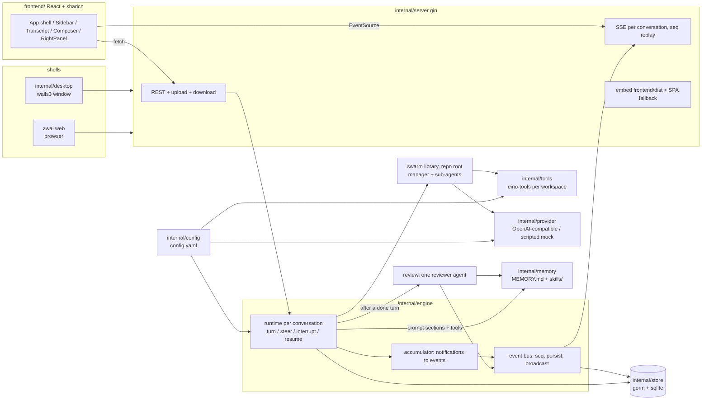

# Architecture

zwai is one Go process. It assembles a config, a SQLite database, a model pool, a
per-conversation agent runtime and an HTTP server, then puts either a native
window or a browser in front of it. Both shells load the **same** `http://127.0.0.1`
origin, so there is exactly one implementation of uploads, downloads and the live
event stream.



## Modules

| package | responsibility |
|---|---|
| `.` (root) | the swarm library: `Registry`, `spawn_agent`/`send_message`/`wait_agents`/`close_agent`/`resume_agent`, `Restore`/`PlantFinished` for leftover workers, `RunWith` → `RunResult{Final, Transcript}`, `Notification` stream. Usable on its own — see [docs/LIBRARY.md](docs/LIBRARY.md). |
| `internal/config` | `config.yaml` under the data directory: load, normalize, atomic save, `OPENAI_*` seeding on first run. Nothing else in the tree hardcodes an endpoint or model. |
| `internal/store` | gorm + pure-Go SQLite. Conversations, transcript messages, turns, the event timeline, model-call records, attachments, follow-ups waiting for the current turn. Sidebar lists conversations and projects by `sort_rank` then last activity (`last_active_at` / `updated_at`); unranked rows interleave by activity so they cannot sit above ranked work that just ran. A drop pins ranks. See [docs/DATA_MODEL.md](docs/DATA_MODEL.md). |
| `internal/provider` | builds eino chat models from config, lists an endpoint's catalog (`GET {base_url}/models`), records per-call telemetry, and provides the scripted offline provider used by `--mock` and the tests. The provider request timeout is idle time between bytes, not the whole streamed body: a thinking model that is still emitting tokens is not cut off. |
| `internal/tools` | assembles the eino-tools toolset anchored at one conversation's workspace; catalog + enable/disable rules feed the Settings UI. |
| `internal/memory` | a project's memory as files: `MEMORY.md` notes under a character budget, `skills/<name>/SKILL.md` procedures, the three agent tools (`memory`, `skill_view`, `skill_manage`), the prompt sections they are rendered into, and the reviewer's instruction. Owns the files; knows nothing about conversations. |
| `internal/engine` | one runtime per conversation: starts turns, queues follow-ups, steers running ones, interrupts, resumes leftover turns (and their in-flight sub-agents) after a crash or quit, folds earlier replay on `/compact` (optional pinned summarizer), pursues a standing `/goal` across turns until `complete_goal`, `block_goal`, a clear/interrupt, or `swarm.goal_max_auto_turns`, converts `swarm.Notification`s into persisted events, manages workspaces, projects and titles (placeholder, then a generated name), and runs the post-turn memory review. |
| `internal/server` | gin: REST, SSE, upload/download, trace, embedded assets. See [docs/API.md](docs/API.md). |
| `internal/app` | wiring shared by both shells, plus listen/serve/shutdown, `openURL` and `revealPath`. |
| `internal/desktop` | wails3 single window pointed at the local server URL. Hidden title bar (no NSToolbar); traffic lights are centred in the 48px HTML header and the front end pads to the zoom button's measured right edge. The top 48px drags natively. A title-bar double-click is a front-end `wails:drag:doubleclick` — Wails will not zoom on the second mousedown itself, because that races the drag. The Dock / taskbar mark is an embedded PNG, inset to Apple's 824/1024 icon grid, rounded to a macOS squircle at runtime, and handed to Wails as `application.Options.Icon`, so `go run` on macOS does not keep the generic Unix-exec glyph, a square canvas, or a tile larger than a bundled `.app`. Quit cancels the event stream so the window is not frozen waiting for it. |
| `internal/tui` | terminal renderer for `zwai tui`, on the same swarm and config. |
| `cmd/zwai` | subcommand table: `desktop`, `web`, `tui`, `trace`, `config`. |
| `frontend/` | React + TypeScript + Tailwind + shadcn/ui, embedded via `frontend/embed.go`. Chrome strings go through `frontend/src/lib/i18n.ts` (`en` / `zh`); the pin is `ui.locale` in `config.yaml` plus a `localStorage` cache, because desktop binds a random loopback. Typeface, size and conversation column width ride `ui.font` / `ui.font_size` / `ui.content_width` the same way. The sidebar splits Pinned (a `PATCH pinned` flag), project folders with nested conversations, and Recents for conversations with no project. A project folder icon is the fold control (hover swaps it for a chevron). Section headers and folders remember expand/collapse in `localStorage`. Skills stay behind `GET /api/projects/:id/skills/:name` and the Memory tab; `GET /api/projects` still carries the skill index for that panel. A drop in the sidebar is `PUT /api/threads/reorder` or `PUT /api/projects/reorder` (a click selects; a drag past 8px reorders, including from the title). |

## A turn, end to end

1. **`POST /api/threads/:id/turns`** → `engine.StartTurn`. Body is
   `{text, images?, files?, from_event_seq?}`. Pasted images are decoded,
   sniffed, stored under `$ZWAI_HOME/inputs/<thread>/` and sent as eino
   `UserInputMultiContent`, not as workspace files. One turn per conversation
   at a time; a second request while one runs returns `409` — except
   `from_event_seq`, which interrupts, truncates from that `user_message`,
   and starts again at that position. Ordinary Enter while running **queues a
   follow-up** (`POST /api/threads/:id/followups`) that starts as the next turn
   after a clean finish. Clicking a waiting row and submitting the edit
   (`PATCH …/followups/:fid`) keeps the same id and puts it at the back of
   the FIFO. **Steer** / ⌘Enter injects into the current turn
   (`POST /api/threads/:id/steer` or `…/followups/:fid/steer`) at the next
   model boundary — it does not kill an in-flight tool, and it does not
   rewind. Pasted images cannot wait in the queue (the row is text) and
   inject now instead.
2. The runtime loads the conversation's transcript from the database (reduced
   to user/assistant messages, so context stays bounded; `/compact` further
   skips `seq <= compact_through_seq` and injects the briefing into the manager
   extra). Manager `agent_message` events are stored as assistant rows as they
   land, and replay also folds any that only exist on the event log — a
   force-quit used to leave the UI with answers the next model call could not
   see. It then resolves the
   conversation's model (`threads.model`, empty = that provider's default; the
   composer lists every catalog name grouped by provider), builds a
   `swarm.Registry` with the configured limits, and builds the toolset anchored
   at the conversation's working directory — `workspaces/<thread-id>/`, or the
   project's directory when it belongs to one, so every conversation in a
   project works on the same files.
3. The manager's system prompt is generated per turn from the live toolset, the
   workspace path, the concurrency limits, and a snapshot of the host
   (OS, architecture, kernel, shell, date, timezone, user, home). It is
   task-agnostic: no example task, filename or domain word is baked into it.
   A standing `/goal` and a `/compact` briefing ride last in that extra so they
   are the most recent thing the model read. While a `/goal` is open the manager
   also gets `complete_goal` and `block_goal` (manager-only, like the memory
   tools). After a clean `done`, if nothing is queued, the runtime starts the
   next turn itself until `complete_goal`, `block_goal`, a clear/interrupt, or
   `swarm.goal_max_auto_turns`. A human message or `PATCH` `goal_resume`
   clears a block or cap and starts again. An in-place edit (`PATCH` `goal_edit`)
   keeps the current status and, if a turn is running, steers the new text in.
   On a project conversation it also carries the project's instruction, its
   notes with how full they are, and an index of its skills — names and
   one-line descriptions only — and the manager gets the three memory tools on
   top of the toolset. A write that would exceed the notes budget is refused
   with the current notes, how many characters over, and (for replace) the
   matched note, so the manager shortens or drops rather than retrying the
   same text. Sub-agents do not get the memory tools: a worker that
   wrote to the project's memory would be writing about work the manager had
   not yet accepted. They do get the same host snapshot as `WorkerPreamble`,
   because they run the same `exec` and would otherwise invent the wrong
   userland. The `spawned` event stores that instruction in `text` so the
   Agents tab, a reload, and `zwai trace` can show what the worker was
   actually told.
4. `Registry.RunWith` drives the manager. It spawns sub-agents, which run
   concurrently under `MaxConcurrent`, each with a watchdog timeout. If the
   manager hits `swarm.manager_max_iterations`, the turn **pauses** (still
   running) and emits `max_iterations`. `POST /api/threads/:id/continue` with
   `continue: true` starts another slice of that size on the same transcript;
   `false` (or interrupt) ends the turn. Steering while paused is also a yes.
5. Every `swarm.Notification` reaches the engine's accumulator, which decides
   what is worth storing:
   - `delta` / `reasoning_delta` are **broadcast only** (`seq = 0`) — they are
     the same text growing, and storing each would be storing the answer N times.
     They are also **coalesced** for `swarm.delta_coalesce_ms` (default 50):
     tokens that arrive inside the window replace the pending event, so a
     50-token-per-second model costs the UI one redraw, not fifty. A tool call,
     a finished worker or the end of the turn flushes whatever is still held
     so the last tokens are not sitting in the coalescer when the row that
     follows them appears;
   - completed messages, tool calls, tool results, spawn/finish, steer and
     cleanup notices are **persisted with a gap-free per-conversation `seq`**,
     then broadcast. A manager `agent_message` also appends an assistant row
     to `messages` so a crash before turn-end still has context to resume;
   Alongside them a ticker emits a `progress` pulse every
   `swarm.progress_interval_seconds`, built from `Registry.Progress()`. It is
   broadcast only, for the same reason a delta is: it restates events that are
   already stored. Without it a turn whose agents are all inside a slow tool
   call streams nothing at all and cannot be told apart from a stuck one.
   Each model call also broadcasts a `usage` pulse (`seq = 0`, not stored):
   last manager prompt vs the selected model's window, plus billed totals for
   this turn and the conversation. The numbers live on `llm_calls`; the pulse
   is so the composer ring moves without waiting for a reload.
6. Turn end: `Registry.Cleanup()` kills sub-agents still running (recorded as a
   `cleanup` event), the remaining transcript (tool traffic, anything not
   already stored with an `agent_message`) is persisted, a terminal `done`/`error`
   event is recorded, then the turn row is closed. Steering that arrived after the
   manager's last model call is not dropped — it starts a follow-up turn, and
   takes that slot ahead of anything waiting in the follow-up table. A clean
   `done` then pops the oldest queued follow-up and starts it; Stop and errors
   leave those rows where they are.
7. **Startup resume.** A turn is `running` until it finishes, errors, or the
   user stops it. A crash, a kill, or quitting the app leaves that row running.
   The next `app.New` calls `Engine.ResumeOrphanedTurns`: every leftover turn
   is launched again on the same id, with a `resumed` event on the timeline,
   feeding replay from stored messages plus any manager answers that only
   made it onto the event log (those are written into `messages` on replay, so
   a second crash does not depend on scanning events). Sub-agents that were
   still running are started again under the same `agent_id` from their event
   log (an in-flight tool call is not replayed mid-call). Workers that already
   `finished` are planted so `wait_agents` / `resume_agent` still resolve the
   id. A quit does not record `cleanup` or `finished` for those in-flight
   workers — that would make the next start treat them as done. Follow-ups
   waiting in `followups` stay queued and run after the leftover turn finishes
   cleanly. Unread `[steer]` messages stay in the leftover turn (a dangling
   tool call is dropped; the steer is not). A user **Stop**
   (`cancelled`) is not resumed.
   Two running rows on one conversation keep the later one.
8. **Review** (project conversations with memory on, `memory.auto_review`): a
   goroutine hands the finished conversation to a single reviewer agent — one
   `adk.ChatModelAgent` with the memory tools, not a swarm — which stores what
   is worth carrying forward. Its model calls are recorded under the same turn
   id as `memory-reviewer`, and one `memory_review` event says what changed. The
   transcript it reads is clipped per message and in total, so a turn that read
  a large file cannot make the review cost more than the work. Reviews of one
  project are serialized: two turns finishing together would each read the same
  bounded notes, both decide there is room, and one would lose its entry. Only
  a turn that finished cleanly is reviewed, and `Shutdown` waits for the ones
  in flight before exiting.
9. **Title** (untitled conversations, `swarm.auto_title`): a goroutine asks the
   configured namer (the conversation's model, or `swarm.title_provider` /
   `swarm.title_model` when pinned) for a short sidebar name. The first message
   stays as a placeholder until it lands. A user rename in between wins. The
  call is recorded under the turn as `title-namer`, and one `title` event
  carries the name; the transcript does not render it. The Trace tab's Full
  log still lists the event. `Shutdown` waits for namers too.

## Why the event stream is built this way

The UI must survive a refresh, a reconnect and a slow client without losing an
event or showing a duplicate:

- **Sequence numbers are assigned under one lock, together with the broadcast**,
  so stored order and streamed order cannot diverge.
- **`GET /api/threads/:id/events` replays first, then goes live**, from a
  subscription taken *before* the replay. Subscribing afterwards would drop
  whatever happened in between — for a streaming turn, the interesting part.
  Duplicates from the overlap are filtered by `seq`.
- **A slow subscriber is marked lagged, not dropped.** When its channel is full
  a persisted event sets a flag instead of vanishing; the connection notices on
  a short tick and catches up from the database. The event that says the turn
  finished can be the one that would have been dropped, and nothing later would
  come to trigger a re-read.
- **Only persisted events carry an SSE `id`.** `Last-Event-ID` (or `?since=`)
  resumes exactly where the client stopped; deltas, progress and usage pulses
  were never stored, so they are never resumed.

The front end folds this stream into blocks per agent in
`frontend/src/lib/transcript.ts`, pairing a tool call with its result by
`tool_call_id` (agents issue several in one message, and they finish out of
order). A turn that ends (`done` / `error`, including a user interrupt) or an
agent that `finished` closes any tool still `pending`: interrupt cancels
in-flight calls without a `tool_result`, and leaving them pending keeps the
spinner next to a row that already says the turn stopped. That reducer is
pure and unit-tested; the store around it only moves data.
Unread steering is split out of the turn body (`splitQueuedSteers`) and rendered
under the live working line: the event is recorded when the text is accepted,
but the manager only reads it at the next model call, and a bubble sitting above
"Working for…" reads as already applied. Messages that are only waiting for this
turn to finish sit in a **Queued** tray on the composer (`followups`), not in
the transcript, until Steer injects them or the turn ends and they start as the
next request.
Answer blocks render as markdown while they stream (`MemoMarkdown` with
`streaming`); `closeIncompleteMarkdown` closes trailing `**` / `` ` `` / `~~`
so a half-typed marker does not flash as punctuation. Completed answers are
memoised so a later token does not re-parse the rest of the conversation.
A live thought is a 10-line scrolling box (`frontend/src/lib/thought-scroll.ts`)
that follows new tokens and fades at the top once earlier lines have left the
viewport; the **Thinking** label uses `MarqueeText` so it sweeps rather than
sitting frozen. It starts open; a click on the row hides it even while tokens
are still arriving (`thoughtExpanded`) — streaming must not force it back open.
Two or more user turns grow a compact tick cluster in the middle of the left
edge of the transcript (`frontend/src/lib/turn-nav.ts`): hover lists those
messages, click scrolls to the turn. The active tick is the turn that owns
the viewport, snapping to the latest when the scroller is at the bottom.
A thought's top fade stays inside that thought's stacking context so it cannot
cover the ticks. Jumping cancels auto-follow in the same click
so a live token cannot yank the viewport back to the bottom.
The transcript follows the live edge until the reader wheels up
(`frontend/src/lib/follow-scroll.ts`). After that, new tokens stay put and a
jump-to-latest control appears; clicking it (or scrolling back to the bottom)
re-pins. The scroll listener binds when `loaded` becomes true — the first paint
is a skeleton with no scroller. Opening a conversation resets the pin and
ignores the layout `scroll` at 0 that a fresh overflow box fires, otherwise a
switch would paint the top of the history and never offer the jump control.
Selecting transcript text (or a sub-agent's log) offers **Add to chat**. The
snippet is stored as a composer annotation — hover to read, edit or drop it —
and prefixed onto the next send (`Selected text:`) so the model sees the quote
without dumping it into the textarea (`frontend/src/lib/quote.ts`,
`frontend/src/lib/selection.ts`).
Each user bubble has a copy control and an edit control under it. Edit turns
that bubble into an in-place editor (Cancel / Send) — the draft stays in the
bubble, not the composer. Send truncates the log from that `user_message`
seq (`POST /api/threads/:id/turns` with `from_event_seq`) and starts the turn
again at that position: everything below vanishes first, the edited bubble
stays with the new text. Live clients hear `rewound` (`seq` 0, not stored)
and keep a local pending row so the bubble does not blink out before the
replacement `user_message` arrives. An image-only send has nothing to copy,
so copy is hidden and edit still opens the box; the original images ride
along unless new ones are attached.
`⌘F` finds in the open conversation rather than in the window chrome
(`frontend/src/lib/find.ts`, `frontend/src/lib/find-dom.ts`): a floating bar
over the transcript, CSS Custom Highlights on the live text nodes, and the
first collapsed thought / tool payload opened when a two-or-more-character
query sits only in its body. The live count can be large; only a window of
hits around the current one is painted, and stream updates are coalesced so a
live turn does not freeze. `Esc` closes that bar before it would interrupt a
running turn.
The composer overlays the bottom of the transcript: a fade, not a hairline,
so the last lines sit under the box (`frontend/src/lib/composer-chrome.ts`).
`--composer-pad` on the conversation stage is the box's height, so follow and
a jump still leave the last message readable.
A ring on the composer (`frontend/src/components/app/context-meter.tsx`) shows
how full the last manager prompt was versus this model's token window. Hover
it for the compact count and this-turn billed in/out/cached/thinking. The window
comes from the selected name (`model_context`, then `context_window`); switching
models changes the percentage without another call. Settings lists one window
field per catalog name so two models on one endpoint are not forced to share a
limit. `0` means unknown — a count,
not a fake 0%, but the arc still grows on a saturating curve scaled by the
compact character budget so the control is not a dead empty circle. The Trace
tab repeats the same snapshot under the turn summary.
Dropping files onto the composer (`frontend/src/lib/composer-drop.ts`) is the
same split as paste vs paperclip: images become vision thumbs, other files
become workspace attachments. A dashed overlay arms while the drag is over the
box; folders are skipped. On send, those workspace files are named on the user
message (`files: ["uploads/…"]` on `POST /turns`) so the model reads this
request's uploads first instead of scavenging leftovers already in `uploads/`.
Tool rows are not a JSON dump: `frontend/src/lib/tool-view.ts` picks the primary
argument (command, query, path, …) for the summary, and parses `exec` /
`web_search` / `python_runner` results into stdout, hits, or a failed flag.
An `exec` row stays one truncated highlighted line until it is opened;
the expanded body then wraps the full command (`frontend/src/lib/shell-highlight.ts`)
so a long invocation is readable, with stdout underneath.
A `read` of a source file uses the same token colours, chosen from the
path suffix (`frontend/src/lib/source-highlight.ts`); markdown still
renders as prose, and an unknown suffix stays plain numbered lines.
`ToolInvokableDefer` can turn a Go error into `error: …` text with `err=nil`;
`exec` can also succeed as JSON with `failed: true` / a non-zero `exit_code`.
The UI treats both as a red error, not a grey success.
`resume_agent` continues a finished worker under the same `agent_id`; a second
`spawned` event for that id is a continuation, not a second roster row.
`spawn_agent` with a role that already exists continues that worker
(new task, same id): queued as steering while it is running, resumed after
it finished. `fork_context` does not mint a twin for an existing role.
Live status text (heartbeat, pending tools, wait roll-up, sub-agent activity) is
rendered by `MarqueeText`: a sweep while the work is in progress, a scroll if
the line overflows, truncation once it is idle.

## Data layout

```
$ZWAI_HOME (default ~/.zwai-swarm)
├── config.yaml            0600, holds the API key
├── zwai.db                everything else
├── workspaces/<thread>/   one per standalone conversation; uploads/ inside
└── projects/<project>/
    ├── workspace/         only when the project has no workdir of its own
    └── memory/            MEMORY.md + skills/<name>/SKILL.md
```

The workspace is where relative tool paths resolve and what the Files panel
shows. The panel nests that listing into a collapsible tree in the client;
`GET /api/threads/:id/files` is still a flat walk, but breadth-first, so a fat
directory that sorts early cannot hide later siblings. It skips
dot-directories, `node_modules` and `vendor` so a repository does not spend
the 2000-entry cap on a VCS or dependency tree. It is **not** a sandbox:
`exec` runs as the user, and absolute paths work.
That is the "Full access" model, stated plainly in the UI rather than implied.

A project's memory is kept here rather than in the working directory: a project
pointed at a repository must not leave files in it. `skill_view` opens only
that tree. A `SKILL.md` that already lives in the workspace is a file — `read`
it; the two layouts look the same and mixing them produces a missing-name call.
For the same reason, deleting a conversation removes its workspace **only when
zwai created it** — `DeleteThread` on a project conversation would otherwise
delete the user's repository — and deleting a project removes its memory and
its managed workspace, never a `workdir` the user supplied.

## Shell differences

Everything is shared except the native affordances, advertised by `GET /api/meta`
so the UI never renders a control it cannot deliver:

| | `zwai web` | `zwai desktop` |
|---|---|---|
| listen address | configured (default `127.0.0.1:8787`) | random loopback port |
| `mode` in `/api/meta` | `web` | `desktop` |
| `capabilities.reveal` | `false` — download instead | `true` — opens the file manager |
| `capabilities.open_url` | `false` — `window.open` a new tab | `true` — system browser |

`capabilities.memory` is not a shell difference: it reports `memory.enabled`, so
the project dialog does not offer a switch the install will ignore.

## Design rules that shaped the code

- **One HTTP surface.** A `wails://` asset protocol would have meant two upload
  paths and two download paths. Loading a local URL keeps one.
- **No hardcoded model or endpoint anywhere.** They come from config; `OPENAI_*`
  only seeds blank fields on first run.
- **Same-origin only.** No CORS headers: a permissive policy on a loopback port
  is how another tab reads your conversations.
- **The turn id is the debug handle.** Every event and model call carries it, the
  UI shows it, and `zwai trace <id>` reconstructs the run from it.
