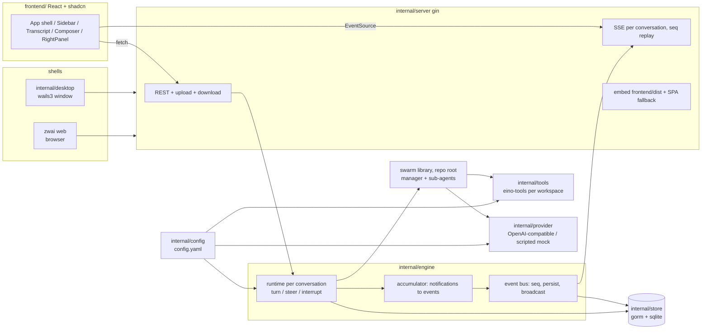

# Architecture

zwai is one Go process. It assembles a config, a SQLite database, a model pool, a
per-conversation agent runtime and an HTTP server, then puts either a native
window or a browser in front of it. Both shells load the **same** `http://127.0.0.1`
origin, so there is exactly one implementation of uploads, downloads and the live
event stream.



## Modules

| package | responsibility |
|---|---|
| `.` (root) | the swarm library: `Registry`, `spawn_agent`/`send_message`/`wait_agents`/`close_agent`, `RunWith` → `RunResult{Final, Transcript}`, `Notification` stream. Usable on its own — see [docs/LIBRARY.md](docs/LIBRARY.md). |
| `internal/config` | `config.yaml` under the data directory: load, normalize, atomic save, `OPENAI_*` seeding on first run. Nothing else in the tree hardcodes an endpoint or model. |
| `internal/store` | gorm + pure-Go SQLite. Conversations, transcript messages, turns, the event timeline, model-call records, attachments. See [docs/DATA_MODEL.md](docs/DATA_MODEL.md). |
| `internal/provider` | builds eino chat models from config, records per-call telemetry, and provides the scripted offline provider used by `--mock` and the tests. |
| `internal/tools` | assembles the eino-tools toolset anchored at one conversation's workspace; catalog + enable/disable rules feed the Settings UI. |
| `internal/engine` | one runtime per conversation: starts turns, steers running ones, interrupts, converts `swarm.Notification`s into persisted events, manages workspaces and titles. |
| `internal/server` | gin: REST, SSE, upload/download, trace, embedded assets. See [docs/API.md](docs/API.md). |
| `internal/app` | wiring shared by both shells, plus listen/serve/shutdown, `openURL` and `revealPath`. |
| `internal/desktop` | wails3 single window pointed at the local server URL. |
| `internal/tui` | terminal renderer for `zwai tui`, on the same swarm and config. |
| `cmd/zwai` | subcommand table: `desktop`, `web`, `tui`, `trace`, `config`. |
| `frontend/` | React + TypeScript + Tailwind + shadcn/ui, embedded via `frontend/embed.go`. |

## A turn, end to end

1. **`POST /api/threads/:id/turns`** → `engine.StartTurn`. One turn per
   conversation at a time; a second request while one runs returns `409` and the
   UI sends it as steering instead.
2. The runtime loads the conversation's transcript from the database (compacted
   to user/assistant messages, so context stays bounded), builds a
   `swarm.Registry` with the configured limits, and builds the toolset anchored
   at `workspaces/<thread-id>/`.
3. The manager's system prompt is generated per turn from the live toolset, the
   workspace path and the concurrency limits. It is task-agnostic: no example
   task, filename or domain word is baked into it.
4. `Registry.RunWith` drives the manager. It spawns sub-agents, which run
   concurrently under `MaxConcurrent`, each with a watchdog timeout.
5. Every `swarm.Notification` reaches the engine's accumulator, which decides
   what is worth storing:
   - `delta` / `reasoning_delta` are **broadcast only** (`seq = 0`) — they are
     the same text growing, and storing each would be storing the answer N times;
   - completed messages, tool calls, tool results, spawn/finish, steer and
     cleanup notices are **persisted with a gap-free per-conversation `seq`**,
     then broadcast.
   Alongside them a ticker emits a `progress` pulse every
   `swarm.progress_interval_seconds`, built from `Registry.Progress()`. It is
   broadcast only, for the same reason a delta is: it restates events that are
   already stored. Without it a turn whose agents are all inside a slow tool
   call streams nothing at all and cannot be told apart from a stuck one.
6. Turn end: `Registry.Cleanup()` kills sub-agents still running (recorded as a
   `cleanup` event), the transcript is persisted, the turn row is closed, and a
   terminal `done`/`error` event is emitted. Steering that arrived after the
   manager's last model call is not dropped — it starts a follow-up turn.

## Why the event stream is built this way

The UI must survive a refresh, a reconnect and a slow client without losing an
event or showing a duplicate:

- **Sequence numbers are assigned under one lock, together with the broadcast**,
  so stored order and streamed order cannot diverge.
- **`GET /api/threads/:id/events` replays first, then goes live**, from a
  subscription taken *before* the replay. Subscribing afterwards would drop
  whatever happened in between — for a streaming turn, the interesting part.
  Duplicates from the overlap are filtered by `seq`.
- **A slow subscriber is marked lagged, not dropped.** When its channel is full
  a persisted event sets a flag instead of vanishing; the connection notices on
  a short tick and catches up from the database. The event that says the turn
  finished can be the one that would have been dropped, and nothing later would
  come to trigger a re-read.
- **Only persisted events carry an SSE `id`.** `Last-Event-ID` (or `?since=`)
  resumes exactly where the client stopped; deltas were never stored, so they
  are never resumed.

The front end folds this stream into blocks per agent in
`frontend/src/lib/transcript.ts`, pairing a tool call with its result by
`tool_call_id` (agents issue several in one message, and they finish out of
order). That reducer is pure and unit-tested; the store around it only moves data.

## Data layout

```
$ZWAI_HOME (default ~/.zwai-swarm)
├── config.yaml            0600, holds the API key
├── zwai.db                everything else
└── workspaces/<thread>/   one per conversation; uploads/ inside
```

The workspace is where relative tool paths resolve and what the Files panel
shows. It is **not** a sandbox: `exec` runs as the user, and absolute paths work.
That is the "Full access" model, stated plainly in the UI rather than implied.

## Shell differences

Everything is shared except two things, both advertised by `GET /api/meta` so the
UI never renders a control it cannot deliver:

| | `zwai web` | `zwai desktop` |
|---|---|---|
| listen address | configured (default `127.0.0.1:8787`) | random loopback port |
| `mode` in `/api/meta` | `web` | `desktop` |
| `capabilities.reveal` | `false` — download instead | `true` — opens the file manager |

## Design rules that shaped the code

- **One HTTP surface.** A `wails://` asset protocol would have meant two upload
  paths and two download paths. Loading a local URL keeps one.
- **No hardcoded model or endpoint anywhere.** They come from config; `OPENAI_*`
  only seeds blank fields on first run.
- **Same-origin only.** No CORS headers: a permissive policy on a loopback port
  is how another tab reads your conversations.
- **The turn id is the debug handle.** Every event and model call carries it, the
  UI shows it, and `zwai trace <id>` reconstructs the run from it.
