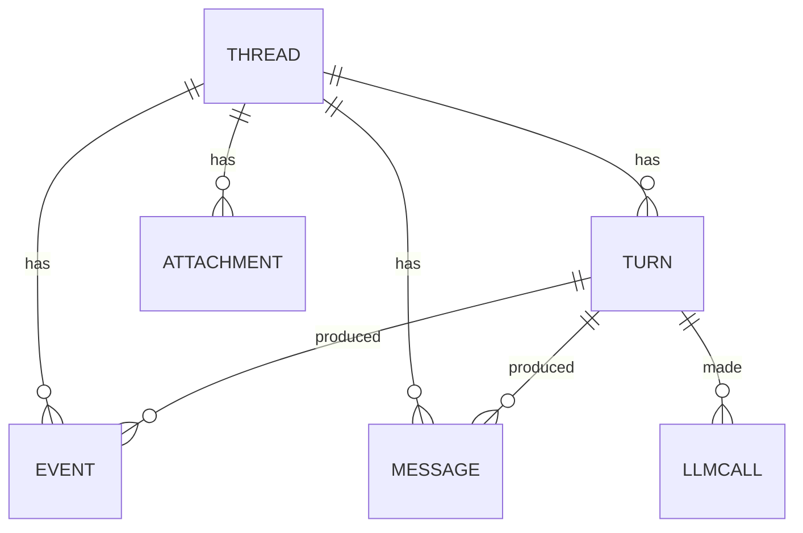

# Data model

Everything except the settings lives in one SQLite file:

```
$ZWAI_HOME (default ~/.zwai-swarm)/zwai.db
```

gorm owns the schema (`AutoMigrate` on every start) and
[`glebarez/sqlite`](https://github.com/glebarez/sqlite) is the driver, so there is
no cgo and no system SQLite to install. The file is opened with
`journal_mode=WAL`, `busy_timeout=5000` and `foreign_keys=1`: WAL is what keeps
the UI's reads from blocking behind a write-heavy streaming turn.

One process owns the file — this is a desktop app — which is why sequence numbers
come from an in-memory counter per conversation, seeded from the table on first
use, instead of a `MAX(seq)` query per row. Events arrive once per streamed token;
a query each would be absurd.



## `threads` — one conversation

| column | type | notes |
|---|---|---|
| `id` | text, PK | `th_` + 8 random bytes hex. **Also the workspace directory name**, so it must stay free of separators and shell metacharacters. |
| `title` | text | generated from the first message when the user did not supply one |
| `provider_id` | text | which configured provider this conversation uses |
| `reasoning_effort` | text | this conversation's thinking level (``, `low`, `medium`, `high`); empty means the model's own default. Switchable in the composer, applied from the next turn |
| `archived` | bool | hidden from the sidebar's default list |
| `created_at` | time | |
| `updated_at` | time | gorm-managed |
| `last_active_at` | time, indexed | bumped at the end of each turn; this is what the sidebar groups by ("Today", "Yesterday", "Earlier") |

## `messages` — the transcript the model sees

The conversation as the **model** reads it, replayed into the next turn. Tool
calls and tool results are kept verbatim rather than summarized, because a model
that sees a truncated tool result will re-run the tool.

| column | notes |
|---|---|
| `id` | auto increment |
| `thread_id`, `turn_id` | which conversation and which turn produced it |
| `seq` | per-conversation, gap-free, `(thread_id, seq)` indexed; the read order |
| `role` | `user`, `assistant`, `tool`, `system` |
| `agent_id` | `manager` or a sub-agent id |
| `content` | the text |
| `reasoning` | the model's thinking, when the endpoint returns it separately |
| `tool_calls` | JSON array, exactly as received |
| `tool_call_id` | set on a tool result, matching the call |

Replay into a later turn is **compacted** to user and assistant messages: the full
tool trace is here for troubleshooting, but feeding all of it back would blow up
the context on a long conversation.

## `turns` — one request and everything done to answer it

The `id` is the handle the whole troubleshooting story hangs off: the UI shows it,
`zwai trace <id>` replays it, `GET /api/trace/:turn` returns it.

| column | notes |
|---|---|
| `id` | `tn_` + hex |
| `thread_id` | |
| `seq` | per-conversation turn number |
| `status` | `running`, `done`, `error`, `cancelled` |
| `user_text` | what was asked |
| `final` | the manager's final answer |
| `error` | why it failed, when it did |
| `provider_id`, `model` | what actually ran, not what is configured now — settings change |
| `reasoning_effort` | the thinking level this turn ran with, so a trace shows what produced the answer |
| `started_at`, `ended_at`, `duration_ms` | `ended_at` is null while running |

A turn is only `running` while a process is working on it. On startup,
`MarkStaleTurnsCancelled` closes anything left `running` by a crash or a `kill`
with `error: "interrupted by shutdown"`, so a restarted app never shows a
conversation frozen mid-answer.

## `events` — the UI timeline

What the front end renders and replays. One row per **completed** thing.

| column | notes |
|---|---|
| `id` | auto increment |
| `thread_id` | |
| `turn_id` | groups a turn's events for the trace view and the turn footers |
| `seq` | per-conversation, gap-free, `(thread_id, seq)` indexed. The SSE `id`, and what `?since=`/`Last-Event-ID` resume from. |
| `kind` | see the [event table in the API docs](API.md#event-stream) |
| `agent_id` | `manager` or a sub-agent |
| `role` | for `spawned`, the sub-agent's role |
| `text` | the payload |
| `tool_call_id` | pairs `tool_call` with `tool_result`; agents issue several at once and they finish out of order |
| `err` | set on `error` and on a failed `finished` |
| `created_at` | UTC; the timeline offsets are computed against the turn's `started_at` |

**Streaming deltas are deliberately not stored.** `delta` and `reasoning_delta`
carry the full text so far, so storing each would store the answer once per token.
They are broadcast live with `seq = 0`; the engine stores the completed block when
it settles. That is why a refresh mid-turn shows completed thoughts and the answer
so far, without a hundred rows per paragraph.

**Progress pulses are not stored either.** A `progress` event restates what the
`spawned`, `tool_call` and `finished` rows already record, so a trace loses
nothing by their absence — while storing one every few seconds would add
hundreds of rows per turn that no replay needs. They too are broadcast with
`seq = 0`.

## `llm_calls` — where the time went

One row per model request. Sizes and durations, **not** prompts: enough to explain
a slow or failed turn without turning the database into a transcript archive.

| column | notes |
|---|---|
| `thread_id`, `turn_id`, `agent_id` | who made the call |
| `provider_id`, `model` | against what |
| `input_msgs` | how many messages were sent — the number that grows on a long conversation |
| `input_chars`, `output_chars` | request and response size |
| `duration_ms` | wall clock |
| `err` | the endpoint's error, when there was one |

## `attachments` — what the human uploaded

| column | notes |
|---|---|
| `thread_id`, `turn_id` | `turn_id` is empty for files uploaded between turns |
| `name` | the original file name |
| `rel_path` | workspace-relative, always under `uploads/` |
| `size` | bytes |

This table exists so the Files panel can separate "what I gave it" from "what it
produced" — the workspace itself does not record provenance. A name that already
exists is saved alongside the old one rather than overwriting it.

## Lifecycle and retention

- **Delete a conversation** (`DELETE /api/threads/:id`): its messages, turns,
  events, model calls and attachments are removed in one transaction, then the
  row, then its workspace directory on disk.
- **Nothing is pruned automatically.** Events are the only table that grows fast;
  if a database ever gets uncomfortable, delete old conversations.
- **Backup** is copying `~/.zwai-swarm` while the app is not running. The
  workspaces are the files themselves, so a backup that skips them loses agent
  output.

## Reading it directly

```bash
sqlite3 ~/.zwai-swarm/zwai.db \
  "select id, status, duration_ms, substr(user_text,1,40) from turns order by started_at desc limit 5"
```

Prefer `zwai trace <turn-id>` — it joins the three tables you actually want and
formats the timeline. Reach for SQL when you need to look across conversations.
