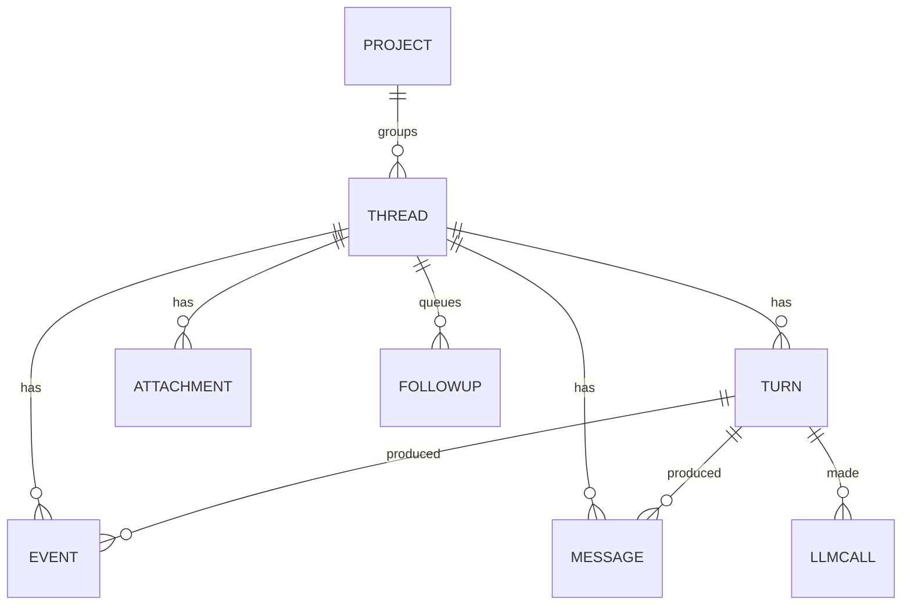

# Data model

Everything except the settings lives in one SQLite file:

```
$ZWAI_HOME (default ~/.zwai-swarm)/zwai.db
```

gorm owns the schema (`AutoMigrate` on every start) and
[`glebarez/sqlite`](https://github.com/glebarez/sqlite) is the driver, so there is
no cgo and no system SQLite to install. The file is opened with
`journal_mode=WAL`, `busy_timeout=5000` and `foreign_keys=1`: WAL is what keeps
the UI's reads from blocking behind a write-heavy streaming turn.

One process owns the file — this is a desktop app — which is why sequence numbers
come from an in-memory counter per conversation, seeded from the table on first
use, instead of a `MAX(seq)` query per row. Events arrive once per streamed token;
a query each would be absurd.



## `projects` — a directory, an instruction and a memory

A project is the thing several conversations have in common. Its memory is not
in this database: notes and skills are files, so a person can read and fix them
(see [on disk](#on-disk)).

| column | type | notes |
|---|---|---|
| `id` | text, PK | `pj_` + 8 random bytes hex. **Also a directory name**, so it stays free of separators |
| `name` | text | what the sidebar shows |
| `system_prompt` | text | added to the manager's prompt for every conversation in the project |
| `workdir` | text | the directory the user chose; empty means zwai manages one |
| `memory_enabled` | bool | whether this project remembers anything. `memory.enabled` in the config can override it off, never on |
| `sort_rank` | int | sidebar drag order. `0` means never dragged: those rows interleave by `updated_at` with ranked rows |
| `created_at`, `updated_at` | time | gorm-managed. `updated_at` is also bumped when a conversation in the project is used, so the default project list is last used, not created |

## `threads` — one conversation

| column | type | notes |
|---|---|---|
| `id` | text, PK | `th_` + 8 random bytes hex. **Also the workspace directory name**, so it must stay free of separators and shell metacharacters. |
| `title` | text | placeholder from the first message, then a generated name after the first finished turn when the user did not supply one |
| `title_auto` | bool | true while the engine still owns the title. A user rename (or a landed generated name) clears it so a slow namer cannot overwrite the sidebar |
| `project_id` | text, indexed | the project this conversation belongs to; empty for a standalone one. It decides where the tools work, what the prompt carries, and whether a review runs |
| `provider_id` | text | which configured provider this conversation uses |
| `model` | text | the name this conversation sends; empty follows the provider's default so a Settings change applies until someone picks in the composer |
| `reasoning_effort` | text | this conversation's thinking level (``, `low`, `medium`, `high`); empty means the model's own default. Switchable in the composer, applied from the next turn |
| `goal` | text | standing objective from `/goal`. Empty means none. Injected into later turns until changed or cleared |
| `goal_complete` | bool | true after `complete_goal`. The text stays so the banner can show what was achieved; auto-continue stops |
| `goal_blocked` | bool | true after `block_goal`. Auto-continue stops until the human resumes or sends a message |
| `goal_block_reason` | text | optional one-line reason from `block_goal` |
| `goal_started_at` | time | when the current objective was set (not edited). Nil when there is no goal |
| `goal_auto_turns` | int | consecutive runtime-started turns that kept pursuing an open goal. A human message resets it |
| `goal_capped` | bool | true after `goal_auto_turns` hit `swarm.goal_max_auto_turns`. A later human message or resume clears it and resets the budget |
| `compact_summary` | text | briefing that replaces earlier replay in the next turn's prompt. Empty means no fold yet |
| `compact_through_seq` | int64 | last event seq included in that briefing. Replay skips `seq <=` this when a summary is set |
| `archived` | bool | hidden from the sidebar's default list |
| `pinned` | bool | tracked in the sidebar Pinned section |
| `pinned_at` | time | when it was pinned; nil when it is not. Newest pin sits at the top |
| `sort_rank` | int | drag order inside Recents or one project. `0` means never dragged: those rows interleave by `last_active_at` with ranked rows |
| `created_at` | time | |
| `updated_at` | time | gorm-managed |
| `last_active_at` | time, indexed | bumped when a turn starts and when it ends. Unranked rows in a group sort by this |

## `messages` — the transcript the model sees

The conversation as the **model** reads it, replayed into the next turn. Tool
calls and tool results are kept verbatim rather than summarized, because a model
that sees a truncated tool result will re-run the tool.

| column | notes |
|---|---|
| `id` | auto increment |
| `thread_id`, `turn_id` | which conversation and which turn produced it |
| `seq` | per-conversation, gap-free, `(thread_id, seq)` indexed; the read order |
| `role` | `user`, `assistant`, `tool`, `system` |
| `agent_id` | `manager` or a sub-agent id |
| `content` | the text |
| `reasoning` | the model's thinking, when the endpoint returns it separately |
| `tool_calls` | JSON array, exactly as received |
| `tool_call_id` | set on a tool result, matching the call |
| `images` | JSON array of `{id,name,mime}` for pasted vision input. The pixels live under `$ZWAI_HOME/inputs/<thread_id>/<id>`, not in this row |

Replay into a later turn is **reduced** to user and assistant messages: the full
tool trace is here for troubleshooting, but feeding all of it back would blow up
the context on a long conversation. Manager answers are written here **as each
`agent_message` lands**, not only when the turn ends — otherwise a force-quit
leaves the UI with a conversation the next model call cannot see. Replay also
folds manager `agent_message` events that never got a row (older crashes) and
writes them into this table so the next force-quit does not depend on the
event scan. An answer already stored for that turn — including below
`compact_through_seq` — is not rewritten; that would mint a new seq and
undo `/compact`.
`/compact` is a second, optional fold: older
of those replay messages become a briefing on the thread (`compact_summary`);
events stay, so the transcript the human sees does not change. Compacted
answers are not unfolded from the event log, even when later messages of
the same turn are still live.

## `turns` — one request and everything done to answer it

The `id` is the handle the whole troubleshooting story hangs off: the UI shows it,
`zwai trace <id>` replays it, `GET /api/trace/:turn` returns it.

| column | notes |
|---|---|
| `id` | `tn_` + hex |
| `thread_id` | |
| `seq` | per-conversation turn number |
| `status` | `running`, `done`, `error`, `cancelled` |
| `user_text` | what was asked |
| `final` | the manager's final answer |
| `error` | why it failed, when it did |
| `provider_id`, `model` | what actually ran, not what is configured now — settings change |
| `reasoning_effort` | the thinking level this turn ran with, so a trace shows what produced the answer |
| `goal_continue` | true when the runtime started this turn to keep pursuing an open `/goal`. The timeline records `goal_continued`, not `user_message` |
| `started_at`, `ended_at`, `duration_ms` | `ended_at` is null while running |

A turn stays `running` until it finishes, errors, or the user stops it. A
crash, a kill, or quitting the app leaves the row running; the next start
calls `ResumeOrphanedTurns` and continues every leftover on the same turn id
(`resumed` on the timeline), replaying manager answers already stored on
`messages` or still only on the event log, and restarting sub-agents that
had `spawned` without `finished` under the same `agent_id`. Follow-ups in
`followups` stay queued until that leftover turn finishes cleanly. Unread
`[steer]` rows stay on the leftover turn. A user **Stop** is
`cancelled` and is not resumed. `MarkStaleTurnsCancelled` still exists as a bulk
wipe; startup does not call it.

## `events` — the UI timeline

What the front end renders and replays. One row per **completed** thing.

| column | notes |
|---|---|
| `id` | auto increment |
| `thread_id` | |
| `turn_id` | groups a turn's events for the trace view and the turn footers |
| `seq` | per-conversation, assigned upward even after a rewind, `(thread_id, seq)` indexed. The SSE `id`, and what `?since=`/`Last-Event-ID` resume from. Editing a `user_message` deletes that row and everything after it, so this column can have a gap; the next event is still larger than the previous high-water mark |
| `kind` | see the [event table in the API docs](API.md#event-stream) |
| `agent_id` | `manager` or a sub-agent |
| `role` | for `spawned`, the sub-agent's role |
| `text` | the payload. For `spawned` this is the worker's system prompt (host snapshot plus the task). Older rows stored the role name here; `role` is the reliable role field. For `tool_result` this is the tool's stdout with newlines kept (clipped at 64k runes), not a one-line summary |
| `tool_call_id` | pairs `tool_call` with `tool_result`; agents issue several at once and they finish out of order |
| `err` | set on `error` and on a failed `finished` |
| `images` | JSON array of `{id,name,mime}` on `user_message` and `steer` when the send carried pasted images. Never the pixels |
| `created_at` | UTC; the timeline offsets are computed against the turn's `started_at` |

**Streaming deltas are deliberately not stored.** `delta` and `reasoning_delta`
carry the full text so far, so storing each would store the answer once per token.
They are broadcast live with `seq = 0`; the engine stores the completed block when
it settles. That is why a refresh mid-turn shows completed thoughts and the answer
so far, without a hundred rows per paragraph.

**Progress pulses are not stored either.** A `progress` event restates what the
`spawned`, `tool_call` and `finished` rows already record, so a trace loses
nothing by their absence — while storing one every few seconds would add
hundreds of rows per turn that no replay needs. They too are broadcast with
`seq = 0`.

**Usage pulses are not stored either.** A `usage` event is the composer meter
restating `llm_calls`. The numbers already live on that table; storing a copy
per call would double it. Broadcast with `seq = 0`. Reload rebuilds the snapshot
from the table. The ring is the last **manager** prompt versus the selected
model's window — counting workers would make the meter jump to a number that is
not this conversation.

**`rewound` is not stored either.** It tells a live client to drop everything
from a `user_message` seq downward after an edit-and-resend. A reload already
sees the truncated tables (`events`, `messages`, `turns`, `llm_calls`,
`followups`). Broadcast with `seq = 0`.

## `llm_calls` — where the time went

One row per model request. Sizes and durations, **not** prompts: enough to explain
a slow or failed turn without turning the database into a transcript archive.

| column | notes |
|---|---|
| `thread_id`, `turn_id`, `agent_id` | who made the call |
| `provider_id`, `model` | against what |
| `input_msgs` | how many messages were sent — the number that grows on a long conversation |
| `input_chars`, `output_chars` | request and response size |
| `prompt_tokens`, `completion_tokens`, `total_tokens` | billed usage from the endpoint. Zero means it did not say; the UI must not invent a tokenizer |
| `cached_tokens`, `reasoning_tokens` | prompt-cache hits and thinking tokens, when the endpoint reports them |
| `duration_ms` | wall clock |
| `err` | the endpoint's error, when there was one |

## `attachments` — what the human uploaded

| column | notes |
|---|---|
| `thread_id`, `turn_id` | `turn_id` is empty for files uploaded between turns (the Files panel). A composer send that attaches those files to the message writes the turn id so a later request can tell this send's files from leftovers |
| `name` | the original file name |
| `rel_path` | workspace-relative, always under `uploads/` |
| `size` | bytes |

This table exists so the Files panel can separate "what I gave it" from "what it
produced" — the workspace itself does not record provenance. A name that already
exists is saved alongside the old one rather than overwriting it.

## `followups` — messages waiting for the current turn

Typed while a turn is already running. They are **not** steering: the manager
does not see them until this turn finishes cleanly and the engine starts the
oldest one as the next turn. Submitting an edit of a waiting row assigns a
new `seq` at the back of that FIFO. **Steer** on a row (or ⌘Enter on a new draft)
pulls that text into the current turn at the next model boundary instead.
Cancelled and failed turns leave the queue alone. A crash, a kill, or quitting
the app also leaves the rows: they are not in-memory, so the next start still
lists them and flushes them after the leftover turn finishes cleanly. Deleting the conversation
deletes leftover rows.

| column | notes |
|---|---|
| `id` | `fu_` + hex |
| `thread_id` | indexed |
| `seq` | per-conversation FIFO; an unshift after a lost `StartTurn` race uses a value in front of whatever is still waiting; submitting an edit assigns a new seq at the back |
| `text` | what will be sent |
| `created_at` | |

## On disk

```
$ZWAI_HOME (default ~/.zwai-swarm)/
├── config.yaml                ui.locale / ui.font / ui.font_size / ui.content_width
├── zwai.db
├── inputs/
│   └── th_ab12…/              pasted images, named by `img_` id
├── workspaces/
│   └── th_ab12…/              a standalone conversation's own directory
└── projects/
    └── pj_cd34…/
        ├── workspace/         only when the project has no workdir of its own
        └── memory/
            ├── MEMORY.md      notes, one per blank-line-separated paragraph
            └── skills/
                └── <skill-name>/   lowercase, digits and dashes only
                    └── SKILL.md
```

`MEMORY.md` and `SKILL.md` are plain files, written atomically through a
temporary file and a rename, so a crash mid-write leaves the old version rather
than half of the new one. `SKILL.md` follows the
[agentskills.io](https://agentskills.io) layout: YAML frontmatter with `name`
and `description`, then the procedure as markdown.

**Memory lives here, never in your working directory.** A project pointed at a
repository must not leave files in it, and a memory that was in the repository
would arrive in a commit, a diff and a code review. `skill_view` reads this
tree only. A `SKILL.md` already in the workspace is a file; the agent `read`s
it rather than opening it as a recorded skill.

## Lifecycle and retention

- **Delete a conversation** (`DELETE /api/threads/:id`): its messages, turns,
  events, model calls, attachments and follow-ups are removed in one transaction, then the
  row, then its workspace directory — **only when zwai created that directory** —
  and its `inputs/` folder. A conversation in a project shares the project's
  directory, which may be the user's own repository, so the workspace is left
  alone; pasted images still go because they never lived there.
- **Delete a project** (`DELETE /api/projects/:id`): its conversations are
  deleted as above, then the project row, then the directories zwai created for
  it — its managed workspace and its memory. A `workdir` the user supplied is
  never touched.
- **Nothing is pruned automatically.** Events are the only table that grows fast;
  if a database ever gets uncomfortable, delete old conversations.
- **Backup** is copying `~/.zwai-swarm` while the app is not running. The
  workspaces and the projects' memory are files, so a backup that skips them
  loses agent output and everything the projects learned.

## Reading it directly

```bash
sqlite3 ~/.zwai-swarm/zwai.db \
  "select id, status, duration_ms, substr(user_text,1,40) from turns order by started_at desc limit 5"
```

Prefer `zwai trace <turn-id>` — it joins the three tables you actually want and
formats the timeline. Reach for SQL when you need to look across conversations.
