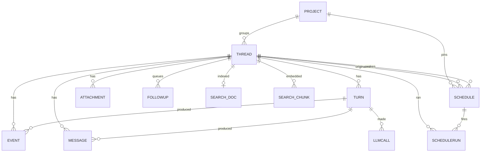

# Data model

Everything except the settings and the phone-pairing key files lives in one SQLite file:

```
$ZWAI_HOME (default ~/.zwai-swarm)/zwai.db
```

Phone pairing keys are not in this database. `$ZWAI_HOME/remote/host_token` and
`$ZWAI_HOME/remote/identity` are 0600 files. Bindings (id, fingerprint,
session) live on the pairlink hub. The phone-reported model and last-seen
time live here in `remote_devices`, keyed by that fingerprint, so Settings
can name a bound phone after it has connected once.
A watched phone reads the same `EVENT` rows the desktop SSE does (clipped
bodies, same `kind`/`seq`); first paint is the last turn on one `ready`
snapshot (the `watch` RPC reply), older rows come from `log` paging. It does not get a second copy
of the timeline.

gorm owns the schema (`AutoMigrate` on every start) and
[`glebarez/sqlite`](https://github.com/glebarez/sqlite) is the driver, so there is
no cgo and no system SQLite to install. The file is opened with
`journal_mode=WAL`, `busy_timeout=5000` and `foreign_keys=1`: WAL is what keeps
the UI's reads from blocking behind a write-heavy streaming turn.

One process owns the file — this is a desktop app — which is why sequence numbers
come from an in-memory counter per conversation, seeded from the table on first
use, instead of a `MAX(seq)` query per row. Events arrive once per streamed token;
a query each would be absurd.



## `projects` — a directory, an instruction and a memory

A project is the thing several conversations have in common. Its memory is not
in this database: notes and skills are files, so a person can read and fix them
(see [on disk](#on-disk)).

| column | type | notes |
|---|---|---|
| `id` | text, PK | `pj_` + 8 random bytes hex. **Also a directory name**, so it stays free of separators |
| `name` | text | what the sidebar shows |
| `system_prompt` | text | added to the manager's prompt for every conversation in the project |
| `workdir` | text | the directory the user chose; empty means zwai manages one |
| `memory_enabled` | bool | whether this project remembers anything. `memory.enabled` in the config can override it off, never on |
| `sort_rank` | int | sidebar drag order. `0` means never dragged: those rows interleave by `updated_at` with ranked rows |
| `created_at`, `updated_at` | time | gorm-managed. `updated_at` is also bumped when a conversation in the project is used, so the default project list is last used, not created |

## `threads` — one conversation

| column | type | notes |
|---|---|---|
| `id` | text, PK | `th_` + 8 random bytes hex. **Also the workspace directory name**, so it must stay free of separators and shell metacharacters. |
| `title` | text | placeholder from the first message, then a generated name from that opening line when the user did not supply one |
| `title_auto` | bool | true while the engine still owns the title. A user rename or a landed generated name clears it so a later namer cannot overwrite the sidebar |
| `project_id` | text, indexed | the project this conversation belongs to; empty for a standalone one. It decides where the tools work, what the prompt carries, and whether a review runs |
| `provider_id` | text | which configured provider this conversation uses |
| `model` | text | the name this conversation sends; empty follows the provider's default so a Settings change applies until someone picks in the composer |
| `reasoning_effort` | text | this conversation's thinking level (``, `low`, `medium`, `high`); empty means the model's own default. Switchable in the composer, applied from the next turn |
| `goal` | text | standing objective from `/goal`. Empty means none. Injected into later turns until changed or cleared |
| `goal_complete` | bool | true after `complete_goal`. The text stays so the banner can show it; auto-continue stops. `reopen_goal` or **Start** on the Done banner clears it, resets `goal_auto_turns`, and pursuit continues |
| `goal_blocked` | bool | true after `block_goal`, or after a pursuing turn fails for a reason that is not a recoverable model error. Auto-continue stops until the human resumes or sends a message |
| `goal_block_reason` | text | optional one-line reason from `block_goal`, or the public turn error when a pursuing turn dies before the manager can call it |
| `goal_started_at` | time | when the current objective was set (not edited). Nil when there is no goal |
| `goal_auto_turns` | int | consecutive runtime-started turns that kept pursuing an open goal. A human message, `reopen_goal`, or **Start** resets it |
| `goal_capped` | bool | true after `goal_auto_turns` hit `swarm.goal_max_auto_turns`, or after the human interrupts a pursuing turn. A later human message or resume clears it and resets the budget |
| `goal_idle` | bool | true after an engine-started continuation finished with no counted tool activity. Auto-continue stops until a human message or resume |
| `plan_mode` | bool | true while `/plan` is open. Write/edit/exec and similar are unmounted; `ask_user` and `propose_plan` stay |
| `plan_markdown` | text | current plan body. The file `$ZWAI_HOME/plans/<thread_id>/PLAN.md` is the on-disk copy; this column is what GET returns |
| `compact_summary` | text | briefing that replaces earlier replay in the next turn's prompt. Empty means no fold yet. Copied from `session_memory` when that is set and accepted. A transcript dump is not stored, and a previously stored dump is omitted from the next manager prompt |
| `compact_through_seq` | int64 | last **message** seq included in that briefing. Replay skips `seq <=` this when a summary is set |
| `session_memory` | text | rolling briefing of this conversation, updated from the event log at token/tool breakpoints (newest events that fit a rune cap). Compact copies it; the post-turn reviewer reads it. Empty until the first accepted refresh. Post-turn refresh is background work and does not block the next follow-up |
| `session_memory_through_seq` | int64 | last **event** seq included in that briefing. Advanced only on an accepted refresh. A rewind that deletes that event clears the three session-memory columns |
| `session_memory_tokens` | int | estimated event-log tokens at the last refresh attempt (accepted or failed), so the next gate knows how far the window has grown and a failed refresh cannot resend the same payload |
| `archived` | bool | hidden from the sidebar's default list |
| `pinned` | bool | tracked in the sidebar Pinned section |
| `pinned_at` | time | when it was pinned; nil when it is not. Newest pin sits at the top |
| `sort_rank` | int | drag order inside Recents or one project. `0` means never dragged: those rows interleave by `last_active_at` with ranked rows |
| `created_at` | time | |
| `updated_at` | time | gorm-managed |
| `last_active_at` | time, indexed | bumped when a turn starts and when it ends. Unranked rows in a group sort by this |

## `messages` — the transcript the model sees

The conversation as the **model** reads it, replayed into the next turn. Tool
calls and tool results are kept verbatim rather than summarized, because a model
that sees a truncated tool result will re-run the tool.

| column | notes |
|---|---|
| `id` | auto increment |
| `thread_id`, `turn_id` | which conversation and which turn produced it |
| `seq` | per-conversation, gap-free, `(thread_id, seq)` indexed; the read order |
| `role` | `user`, `assistant`, `tool`, `system` |
| `agent_id` | `manager` or a sub-agent id |
| `content` | the text |
| `reasoning` | the model's thinking, when the endpoint returns it separately |
| `tool_calls` | JSON array, exactly as received |
| `tool_call_id` | set on a tool result, matching the call |
| `images` | JSON array of `{id,name,mime}` for pasted vision input. The pixels live under `$ZWAI_HOME/inputs/<thread_id>/<id>`, not in this row |
| `event_seq` | timeline seq of the `steer` that minted this `[steer]` user row. Retract (`DELETE …/steers/:seq`) deletes by this column so two identical captions do not collide. Empty on every other role |

Replay into a later turn is **reduced** to user and assistant messages: the full
tool trace is here for troubleshooting, but feeding all of it back would blow up
the context on a long conversation. Manager answers are written here **as each
`agent_message` lands**, not only when the turn ends — otherwise a force-quit
leaves the UI with a conversation the next model call cannot see. Replay also
folds manager `agent_message` events that never got a row (older crashes) and
writes them into this table so the next force-quit does not depend on the
event scan. An answer already stored for that turn — including below
`compact_through_seq` — is not rewritten; that would mint a new seq and
undo `/compact`.
`/compact` is a second, optional fold: older
of those replay messages become a briefing on the thread (`compact_summary`),
copied from `session_memory` when that briefing exists;
events stay, so the transcript the human sees does not change. The same
columns are written mid-turn when a manager call would exceed
`swarm.auto_compact_tokens` (after older replayable tool results are cleared). Compacted
answers are not unfolded from the event log, even when later messages of
the same turn are still live. Worker identity is **not** in this table: it
lives on `spawned` / `finished` events. After a fold, synthetic
`spawn_agent` pairs are re-injected from those events so the next Generate
still has the ids. The in-flight ReAct tail stays in ADK state; that is
not roster data.

## `turns` — one request and everything done to answer it

The `id` is the handle the whole troubleshooting story hangs off: the UI shows it,
`zwai trace <id>` replays it, `GET /api/trace/:turn` returns it.

| column | notes |
|---|---|
| `id` | `tn_` + hex |
| `thread_id` | |
| `seq` | per-conversation turn number |
| `status` | `running`, `done`, `error`, `cancelled` |
| `user_text` | what was asked. On `goal_continue` / `schedule_continue` this is the protocol prompt the model saw, not a human send |
| `final` | the manager's final answer |
| `error` | why it failed, when it did |
| `provider_id`, `model` | what actually ran, not what is configured now — settings change |
| `reasoning_effort` | the thinking level this turn ran with, so a trace shows what produced the answer |
| `goal_continue` | true when the runtime started this turn to keep pursuing an open `/goal`. The timeline records `goal_continued`, not `user_message` |
| `schedule_run_id` | set when this turn is a scheduled fire; empty for every other origin. Trace joins the run through it |
| `quiet` | true when a scheduled turn had nothing to report. The row stays for `zwai trace`; the transcript hides the bubbles |
| `schedule_continue` | true when the engine started this turn because a schedule fired. The timeline records `schedule_fired`, not `user_message` |
| `started_at`, `ended_at`, `duration_ms` | `ended_at` is null while running |

A turn stays `running` until it finishes, errors, or the user stops it. A
  crash, a kill, or quitting the app leaves the row running; the next start
calls `ResumeOrphanedTurns` and continues every leftover on the same turn id
(`resumed` on the timeline), replaying manager answers already stored on
`messages` or still only on the event log, and restarting sub-agents that
had `spawned` without `finished` under the same `agent_id`. An in-flight
`exec` (or any non-wait tool) with no `tool_result` is closed on that
timeline before `resumed` (`err` is `the previous process stopped`) so a
killed process does not leave the call looking live. A dangling
`wait_agents` is closed as a timed-out wait snapshot of those ids, not as a
stopped exec, so the manager can wait again on the live workers. Follow-ups in
`followups` stay queued until that leftover turn finishes cleanly. Unread
`[steer]` rows stay on the leftover turn unless they were retracted
(`steer_retracted` plus `DeleteMessageByEventSeq`). A user **Stop** is
`cancelled` and is not resumed. Two running leftovers on one conversation
keep the later one; a leftover `schedule_continue` that resume cannot
restart (no request, missing provider, gone conversation) or that is
dropped as superseded closes the bound `schedule_runs` row as `error`
so `HasRunningRun` cannot stick. `MarkStaleTurnsCancelled` still exists as a bulk
wipe; startup does not call it.

## `events` — the UI timeline

What the front end renders and replays. One row per **completed** thing.
`GET /api/threads/:id/log` reads this table from the newest seq backward so
opening a conversation does not replay the whole log; `?since=` on the event
stream still walks forward.

| column | notes |
|---|---|
| `id` | auto increment |
| `thread_id` | |
| `turn_id` | groups a turn's events for the trace view and the turn footers |
| `seq` | per-conversation, assigned upward even after a rewind, `(thread_id, seq)` indexed. The SSE `id`, and what `?since=`/`Last-Event-ID` resume from. Editing a `user_message` deletes that row and everything after it, so this column can have a gap; the next event is still larger than the previous high-water mark |
| `kind` | see the [event table in the API docs](API.md#event-stream) |
| `agent_id` | `manager` or a sub-agent |
| `role` | for `spawned`, the sub-agent's role |
| `text` | the payload. For `spawned` this is the worker's system prompt (host snapshot plus the task). Older rows stored the role name here; `role` is the reliable role field. For `tool_result` this is the tool's stdout with newlines kept (clipped at 64k runes), not a one-line summary |
| `tool_call_id` | pairs `tool_call` with `tool_result` (and live `tool_delta`); agents issue several at once and they finish out of order |
| `err` | set on `error` and on a failed `finished` |
| `images` | JSON array of `{id,name,mime}` on `user_message` and `steer` when the send carried pasted images. Never the pixels |
| `created_at` | UTC; the timeline offsets are computed against the turn's `started_at` |

`spawned`, `finished` and `cleanup` are the worker roster. Auto-compact
re-injects those ids into the next Generate after a fold. Do not treat
`messages` as the source of truth for who is alive. The live-edge log
page (`GET /api/threads/:id/log`) sends those rows as `roster` when they
are no longer in the viewport, so the Agents tab can be rebuilt without
walking the whole tool log. The client must not fold those sidecar seqs
into the manager transcript as "Started" rows — that is how a long
`/goal` opened as a wall of agent names. Clicking a worker loads
`GET /api/threads/:id/agents/:agent/log` (that `agent_id` only).

**Streaming deltas are deliberately not stored.** `delta`, `reasoning_delta` and
`tool_delta` carry the full text so far, so storing each would store the answer
(or the command output) once per chunk. They are broadcast live with `seq = 0`;
the engine stores the completed block when it settles. `tool_delta` is keyed by
`tool_call_id` so two parallel `exec` calls keep their own snapshots. That is
why a refresh mid-turn shows completed thoughts and the answer so far, without a
hundred rows per paragraph — and why a reconnect never resumes mid-`exec` output.

**Progress pulses are not stored either.** A `progress` event restates what the
`spawned`, `tool_call` and `finished` rows already record, so a trace loses
nothing by their absence — while storing one every few seconds would add
hundreds of rows per turn that no replay needs. They too are broadcast with
`seq = 0`.

**Usage pulses are not stored either.** A `usage` event is the composer meter
restating `llm_calls`. The numbers already live on that table; storing a copy
per call would double it. Broadcast with `seq = 0`. Reload rebuilds the snapshot
from the table. The ring is the last **manager** prompt versus the selected
model's window — counting workers would make the meter jump to a number that is
not this conversation.

**`rewound` is not stored either.** It tells a live client to drop everything
from a `user_message` seq downward after an edit-and-resend. A reload already
sees the truncated tables (`events`, `messages`, `turns`, `llm_calls`,
`followups`). Broadcast with `seq = 0`.

## `llm_calls` — where the time went

One row per model request. Sizes and durations, **not** prompts: enough to explain
a slow or failed turn without turning the database into a transcript archive.

| column | notes |
|---|---|
| `thread_id`, `turn_id`, `agent_id` | who made the call |
| `provider_id`, `model` | against what |
| `input_msgs` | how many messages were sent — the number that grows on a long conversation |
| `input_chars`, `output_chars` | request and response size |
| `prompt_tokens`, `completion_tokens`, `total_tokens` | billed usage from the endpoint. Zero means it did not say; the UI must not invent a tokenizer |
| `cached_tokens`, `reasoning_tokens` | prompt-cache hits and thinking tokens, when the endpoint reports them |
| `duration_ms` | wall clock |
| `err` | the endpoint's error, when there was one |

## `attachments` — what the human uploaded

| column | notes |
|---|---|
| `thread_id`, `turn_id` | `turn_id` is empty for files uploaded between turns (the Files panel). A composer send that attaches those files to the message writes the turn id so a later request can tell this send's files from leftovers |
| `name` | the original file name |
| `rel_path` | workspace-relative, always under `uploads/` |
| `size` | bytes |

This table exists so the Files panel can separate "what I gave it" from "what it
produced" — the workspace itself does not record provenance. A name that already
exists is saved alongside the old one rather than overwriting it.

## `followups` — messages waiting for the current turn

Typed while a turn is already running. They are **not** steering: the manager
does not see them until this turn finishes cleanly and the engine starts the
oldest one as the next turn. The live turn's user text is not stored as a
follow-up. Submitting an edit of a waiting row assigns a
new `seq` at the back of that FIFO. **Steer** on a row (or ⌘Enter on a new draft)
pulls that text into the current turn at the next model boundary instead and
drops a queued copy of the same words.
**Interrupt** on the unread-steer pin aborts the current manager tool so those
steers drain on this turn; **Delete** retracts one unread `steer` (event stays,
the `[steer]` message is dropped).
Cancelled and failed turns leave the queue alone. A crash, a kill, or quitting
the app also leaves the rows: they are not in-memory, so the next start still
lists them and flushes them after the leftover turn finishes cleanly. Deleting the conversation
deletes leftover rows.

| column | notes |
|---|---|
| `id` | `fu_` + hex |
| `thread_id` | indexed |
| `seq` | per-conversation FIFO; an unshift after a lost `StartTurn` race uses a value in front of whatever is still waiting; submitting an edit assigns a new seq at the back |
| `text` | what will be sent |
| `created_at` | |

## `schedules` — a wall-clock wait

A schedule is either a **thread wake** (lands on an existing conversation) or a
**standalone** job (mints a new conversation per fire). `next_run_at` is stored
UTC. Cadence columns (`delay_s`, `every_s`, `cron`) are persisted as given; the
engine enforces that exactly one is set.

| column | notes |
|---|---|
| `id` | `sch_` + 8 random bytes hex. Filesystem-safe, same family as thread ids |
| `kind` | `thread` or `standalone` |
| `origin_thread_id` | conversation that created it. Standalone fires do **not** reuse it |
| `thread_id` | wakes only: the conversation to wake. Empty on standalone rows |
| `project_id` | standalone workspace; empty means that fire gets its own directory |
| `provider_id`, `model`, `reasoning_effort` | standalone; wakes use the target conversation's model |
| `title`, `prompt` | display name + durable per-run instruction (user text) |
| `delay_s`, `every_s`, `cron` | one-shot delay, interval, or 5-field cron. Engine layer |
| `status` | `active`, `paused`, `done`, `cancelled`. Claim marks a delay `done`. `report_schedule` `next_in_s` may flip `done` → `active` under the same cap as create/resume; cancelled and paused stay dead |
| `next_run_at`, `last_run_at` | UTC. Due = `status=active` AND `next_run_at <= now` |
| `run_count`, `max_runs`, `until_at` | `0` / null means until cancelled |
| `created_by` | `human` or `manager` |
| `created_at`, `updated_at` | |

Deleting a conversation **cancels** wakes whose `thread_id` is that
conversation. Standalone rows that only have `origin_thread_id` stay `active`.
Deleting a project cancels those same targeted wakes **and** standalone rows
pinned to that `project_id`.

## `schedule_runs` — one fire (or a skipped tick)

| column | notes |
|---|---|
| `id` | `srun_` + hex |
| `schedule_id` | which schedule fired |
| `thread_id` | the conversation that ran: the wake target, or the conversation minted for a standalone fire |
| `turn_id` | the turn that ran, when one started. Empty on a skip |
| `status` | `skipped_busy`, `running`, `findings`, `quiet`, `error` |
| `summary` | short findings text from a fire. The inbox does not paint it on live rows; **Open findings** opens the conversation. Empty on quiet |
| `unread` | true for `findings` and `error`. Quiet runs are not unread |
| `created_at`, `updated_at`, `ended_at` | `ended_at` is null while `running` |

## On disk

```
$ZWAI_HOME (default ~/.zwai-swarm)/
├── config.yaml                ui.locale / ui.font / ui.font_size / ui.content_width
├── zwai.db
├── inputs/
│   └── th_ab12…/              pasted images, named by `img_` id
├── workspaces/
│   └── th_ab12…/              a standalone conversation's own directory
├── plans/
│   └── th_ab12…/
│       └── PLAN.md            `/plan` draft; not in the workspace
└── projects/
    └── pj_cd34…/
        ├── workspace/         only when the project has no workdir of its own
        └── memory/
            ├── MEMORY.md      notes, one per blank-line-separated paragraph
            └── skills/
                └── <skill-name>/   lowercase, digits and dashes only
                    └── SKILL.md
```

`MEMORY.md` and `SKILL.md` are plain files, written atomically through a
temporary file and a rename, so a crash mid-write leaves the old version rather
than half of the new one. `PLAN.md` is the `/plan` draft for that conversation:
app data, never a file in the user's workspace. `SKILL.md` follows the
[agentskills.io](https://agentskills.io) layout: YAML frontmatter with `name`
and `description`, then the procedure as markdown. Agent writes to `MEMORY.md`
are also capped per paragraph (`memory.entry_max`); a create that collides with
an existing skill is refused; a note that restates a skill's summary or steps
is refused. Hand-edits and the Memory panel still use the
total `char_limit` only.

**Memory lives here, never in your working directory.** A project pointed at a
repository must not leave files in it, and a memory that was in the repository
would arrive in a commit, a diff and a code review. `skill_view` reads this
tree only — the manager and sub-agents both have it; only the manager (and
the post-turn reviewer) can write. A `SKILL.md` already in the workspace is a
file; the agent `read`s it rather than opening it as a recorded skill.

## `search_docs` / `thread_fts` — keyword index

One row per conversation. Rebuilt from the title, standing goal and
user/assistant messages. Tool dumps stay out so JSON keys cannot drown hits.
`thread_fts` is an FTS5 trigram virtual table content-synced by triggers.
Creating it rebuilds from whatever `search_docs` already holds, so an upgrade
does not sit on an empty MATCH until the next title edit.
Queries shorter than three runes skip MATCH and use LIKE, so two-character CJK
still hits. Archived conversations are filtered at query time.

| column | notes |
|---|---|
| `id` | integer PK; FTS `content_rowid` |
| `thread_id` | unique, the conversation |
| `title` | sidebar name at index time |
| `body` | concatenated goal + messages, capped |

## `search_chunks` — optional embedding passages

Only filled when `search.embedding` is on and a model is named. One row per
passage per model. Vectors are little-endian float32. A pin change deletes
rows whose `model` is not the current name.

| column | notes |
|---|---|
| `id` | integer PK |
| `thread_id`, `chunk_key`, `model` | unique together. `chunk_key` is `title`, `goal`, or `msg:<id>` |
| `text_hash` | sha256 of the passage; unchanged text is not re-embedded |
| `dim` | vector length |
| `vector` | packed float32 |

## `remote_devices` — bound phone labels

The hub list is fingerprints. After a phone links, this PC stores the
model line it sent (`hello`) so Settings → Phone can show that instead
of hex. A quiet reconnect (no `hello` yet) updates `seen_at` and must
not wipe `label`.

| column | notes |
|---|---|
| `device_fp` | text, PK. pairlink fingerprint (16 hex chars) |
| `label` | the phone-reported one-line model, clipped to 80 runes |
| `seen_at` | last time this fingerprint opened a link |

## Lifecycle and retention

- **Delete a conversation** (`DELETE /api/threads/:id`): its messages, turns,
  events, model calls, attachments, follow-ups and search index (keyword doc
  plus embedding chunks) are removed in one transaction, then the
  row, then its workspace directory — **only when zwai created that directory** —
  and its `inputs/` folder and `$ZWAI_HOME/plans/<id>/`. Wakes whose `thread_id`
  is that conversation are cancelled in the same transaction; standalone
  schedules that only originated there stay. A conversation in a project shares the project's
  directory, which may be the user's own repository, so the workspace is left
  alone; pasted images still go because they never lived there.
- **Delete a project** (`DELETE /api/projects/:id`): its conversations' messages,
  turns, events, model calls, attachments and follow-ups are removed. Wakes
  whose `thread_id` is one of those conversations, and standalone schedules
  pinned to that `project_id`, are cancelled in the same transaction. Then the
  project row, then the directories zwai created for it — its managed workspace
  and its memory. A `workdir` the user supplied is never touched.
- **Nothing is pruned automatically.** Events are the only table that grows fast;
  if a database ever gets uncomfortable, delete old conversations.
- **Backup** is copying `~/.zwai-swarm` while the app is not running. The
  workspaces and the projects' memory are files, so a backup that skips them
  loses agent output and everything the projects learned.

## Reading it directly

```bash
sqlite3 ~/.zwai-swarm/zwai.db \
  "select id, status, duration_ms, substr(user_text,1,40) from turns order by started_at desc limit 5"
```

Prefer `zwai trace <turn-id>` — it joins the three tables you actually want and
formats the timeline. Reach for SQL when you need to look across conversations.
